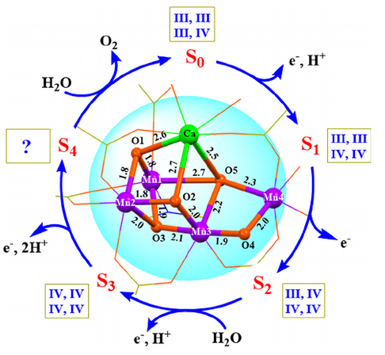
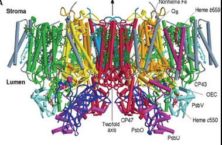

## oxygen-evolving complex (Mn cluster, OEC)

### Structure

🔎

 
Source: Oxygen-evolving photosystem II structures during S1–S2–S3 transitions 
Author: Hiroki Nagashima1,2, Mizue Asada1,3 and Hiroyuki Mino1  
Page: 5 
Link: https://www.nature.com/articles/s41586-023-06987-5 

    

### Location

🔎

 
Source: Magnetic structure of manganese cluster in photosystem II investigated by electron paramagnetic resonance 
Author: 
Hiroki Nagashima, 
Mizue Asada, 
Hiroyuki Mino
 
Page: 2 
Link:https://www.researchgate.net/publication/355229297_Rare-Earth_Elements_Can_Structurally_and_Energetically_Replace_the_Calcium_in_a_Synthetic_Mn_4_CaO_4_-Cluster_Mimicking_the_Oxygen-Evolving_Center_in_Photosynthesis 

    

### function
 
 <small>OEC node setup. Note: OEC is a child node of photosystem II</small>  

[//]: # (1. Try this.)

  

    ✅ The OEC binds two water molecules.🔎
  

   
  <b>Link:</b> <a href="https://www.researchgate.net/publication/322943116_Magnetic_structure_of_manganese_cluster_in_photosystem_II_investigated_by_electron_paramagnetic_resonance">
  Magnetic structure of manganese cluster in photosystem II investigated by electron paramagnetic resonance .</a> 
  <b>Author:</b> Hiroki Nagashima, Mizue Asada, Hiroyuki Mino 

  

    ✅ When an electron inside P680 is  excited, that electron is transfered to pheophytin. This event turns P680 into a very powerful oxidant and P680 takes an electron from a nearby tyrosine. The tyrosine then takes an electron from the OEC, which gets an electron from one of the water molecules bound to it.🔎
  

   
  <b>Link:</b> <a href="https://www.researchgate.net/publication/322943116_Magnetic_structure_of_manganese_cluster_in_photosystem_II_investigated_by_electron_paramagnetic_resonance">
  The Kok Cycle and Oxygen Evolving Complex of Photosystem II .</a> 
  <b>Author: </b>Henry Jakubowski, Patricia Flatt 

  

    ❌ Each extracted electron from a water molecule also results in release of one proton from the same water molecule.🔎
  

   
  <b>Link:</b> <a href="INSERT">
  INSERT</a> 
  <b>Author: </b>INSERT 

A total of four electrons are extracted by P680 

🔎

 
Source: 
Author: 
Page: 
Link: 

      

  

    
 View OEC's script 🔎

    
      ## OEC 

    ## Variables
    var OEC_is_electronised = true
    var electrons_that_are_pulled_towards_OEC_center: Array = []
    var electrons_inside_OEC_center: Array = []

    var bodies_that_entered_Water_pulling_area: Array = []

    var first_H2O_position_is_occupied = false
    var second_H2O_position_is_occupied = false

    # Particle locking
    var first_H2O
    var second_H2O

    const KEY_first_H2O  := "distance_of_bound_first_H2O_to_OEC_center"
    const KEY_second_H2O := "distance_of_bound_second_H2O_to_OEC_center"

    var OEC_dictionary_for_distances := {
      KEY_first_H2O:  Dictionary(),  # body(Node2D) -> Vector2 offset to chosen OEC anchor
      KEY_second_H2O: Dictionary(),  # body(Node2D) -> Vector2 offset to chosen OEC anchor
    }

    ## Triggered functions
    # Nothing here

    func body_entered_Water_pulling_area(body):
      if body.is_in_group("H2O"):
        var H2O = body
        bodies_that_entered_Water_pulling_area.append(H2O)
        await get_tree().create_timer(3).timeout
        bodies_that_entered_Water_pulling_area.erase(H2O)

    func body_exited_Water_pulling_area(body):
      bodies_that_entered_Water_pulling_area.erase(body)

    func body_entered_OEC_center(body):
      if body.is_in_group("H2O") \
      and first_H2O_position_is_occupied == false:
        first_H2O = body
        _OEC_disabling_physics_process_and_storing_offset_of_locked_particles(first_H2O)
        
      elif body.is_in_group("H2O") \
      and first_H2O_position_is_occupied == true \
      and second_H2O_position_is_occupied == false:
        second_H2O = body
        _OEC_disabling_physics_process_and_storing_offset_of_locked_particles(second_H2O)
        
      elif body.is_in_group("electron") \
      and electrons_inside_OEC_center.has(body) == false \
      and electrons_that_are_pulled_towards_OEC_center.has(body) == true:
        electrons_inside_OEC_center.append(body)
        OEC_is_electronised = true
        releasing_of_electrons_from_OEC()

        
    func body_exited_OEC_center(body):
      pass
        
        
        
        
        
        
        
    func releasing_of_electrons_from_OEC():
      
      if P680_is_electronised == false \
      and electrons_that_are_pulled_towards_tyrosine_center.size() < 1 \
      and electrons_that_are_pulled_towards_P680_center.size() < 1:
        
        var electron1 = electrons_that_are_pulled_towards_OEC_center[0]
        electrons_that_are_pulled_towards_OEC_center.erase(electron1)
        electrons_inside_OEC_center.erase(electron1)
        electrons_that_are_pulled_towards_tyrosine_center.append(electron1)
        OEC_is_electronised = false

      if first_H2O != null \
      and second_H2O != null:
        if first_H2O.get_node_or_null("O_SimpleSprite").visible == true \
        and second_H2O.get_node_or_null("O_SimpleSprite").visible == true:

          self.get_node_or_null("OEC/Center").set_deferred("monitoring", false)
          self.get_node_or_null("OEC/Pulling_area").set_deferred("monitoring", false)
          
          ##CollisionShape_copy.queue_free() FIX!!!!!!!!!!
          first_H2O.remove_from_group("H2O")
          first_H2O.add_to_group("O")

          first_H2O.set_physics_process(true)
          first_H2O.get_node_or_null("CollisionShape2D").set_deferred("disabled", false)
          OEC_dictionary_for_distances[KEY_first_H2O].erase(first_H2O)
          first_H2O_position_is_occupied = false
          
          
          ##CollisionShape_copy.queue_free() FIX !!!!!!!!!!!!!
          second_H2O.remove_from_group("H2O")
          second_H2O.add_to_group("O")
          second_H2O.set_physics_process(true)
          second_H2O.get_node_or_null("CollisionShape2D").set_deferred("disabled", false)
          OEC_dictionary_for_distances[KEY_second_H2O].erase(second_H2O)
          second_H2O_position_is_occupied = false
          
          await get_tree().create_timer(1).timeout
          self.get_node_or_null("OEC/Center").set_deferred("monitoring", true)
          self.get_node_or_null("OEC/Pulling_area").set_deferred("monitoring", true)
          

    func _OEC_disabling_physics_process_and_storing_offset_of_locked_particles(particle):
      particle.get_node_or_null("CollisionShape2D").set_deferred("disabled", true)
      particle.set_physics_process(false)
      await get_tree().create_timer(0.01).timeout

      if particle.is_in_group("H2O"):
        if first_H2O_position_is_occupied == false:
          OEC_dictionary_for_distances[KEY_first_H2O][particle] = particle.global_position - $OEC/first_H2O_PositionSprite.global_position
          first_H2O_position_is_occupied = true
          
          var CollisionShape_copy := CollisionShape2D.new()
          CollisionShape_copy.shape = particle.get_node_or_null("CollisionShape2D").shape
          add_child(CollisionShape_copy)
          CollisionShape_copy.global_transform = particle.get_node_or_null("CollisionShape2D").global_transform
          
          #await get_tree().create_timer(5).timeout
          #CollisionShape_copy.queue_free()
          
          #self.get_node_or_null("OEC/Center").set_deferred("monitoring", false)
          #self.get_node_or_null("OEC/Pulling_area").set_deferred("monitoring", false)
          #particle.set_physics_process(true)
          #particle.get_node_or_null("CollisionShape2D").set_deferred("disabled", false)
          #OEC_dictionary_for_distances[KEY_first_H2O].erase(particle)
          #first_H2O_position_is_occupied = false
          
          #await get_tree().create_timer(1).timeout
          #self.get_node_or_null("OEC/Center").set_deferred("monitoring", true)
          #self.get_node_or_null("OEC/Pulling_area").set_deferred("monitoring", true)
          

          
        elif second_H2O_position_is_occupied == false:
          OEC_dictionary_for_distances[KEY_second_H2O][particle] = particle.global_position - $OEC/second_H2O_PositionSprite.global_position
          second_H2O_position_is_occupied = true
          
          var CollisionShape_copy := CollisionShape2D.new()
          CollisionShape_copy.shape = particle.get_node_or_null("CollisionShape2D").shape
          add_child(CollisionShape_copy)
          CollisionShape_copy.global_transform = particle.get_node_or_null("CollisionShape2D").global_transform
          
          #await get_tree().create_timer(5).timeout
          #CollisionShape_copy.queue_free()
          
          #self.get_node_or_null("OEC/Center").set_deferred("monitoring", false)
          #self.get_node_or_null("OEC/Pulling_area").set_deferred("monitoring", false)
          #particle.set_physics_process(true)
          #particle.get_node_or_null("CollisionShape2D").set_deferred("disabled", false)
          #OEC_dictionary_for_distances[KEY_second_H2O].erase(particle)
          #second_H2O_position_is_occupied = false
    #
          #
          #await get_tree().create_timer(1).timeout
          #self.get_node_or_null("OEC/Center").set_deferred("monitoring", true)
          #self.get_node_or_null("OEC/Pulling_area").set_deferred("monitoring", true)
        delectronation_of_water()

    func delectronation_of_water():
      print("delectronation_of_water")
      if P680_is_electronised == false \
      and first_H2O != null \
      and second_H2O != null \
      and electrons_that_are_pulled_towards_OEC_center.size() < 1:
        
        
        if first_H2O.get_node_or_null("H2O_SimpleSprite").visible == true:
          
          for i in range(1):
            var electron = load("res://scenes/level_7_scenes_and_scripts/electron.tscn").instantiate()
            electron.global_position = $OEC/first_H2O_PositionSprite.global_position + (Vector2.RIGHT * randf_range(0.0, 1.0))
            electron.direction = Vector2(randf_range(-1.0, 1.0), randf_range(-1.0, 1.0)).normalized()
            Globals.current_scene.add_child(electron)
            electrons_that_are_pulled_towards_OEC_center.append(electron)
            
          for i in range(1):
            var proton = load("res://scenes/level_7_scenes_and_scripts/proton.tscn").instantiate()
            proton.global_position = $OEC/first_H2O_PositionSprite.global_position + (Vector2.RIGHT * randf_range(0.0, 1.0))
            proton.direction = Vector2(randf_range(-1.0, 1.0), randf_range(-1.0, 1.0)).normalized()
            Globals.current_scene.add_child(proton)
            
          first_H2O.get_node_or_null("H2O_SimpleSprite").visible = false
          first_H2O.get_node_or_null("OH_SimpleSprite").visible = true
          
        elif first_H2O.get_node_or_null("OH_SimpleSprite").visible == true:
          
          for i in range(1):
            var electron = load("res://scenes/level_7_scenes_and_scripts/electron.tscn").instantiate()
            electron.global_position = $OEC/first_H2O_PositionSprite.global_position + (Vector2.RIGHT * randf_range(0.0, 1.0))
            electron.direction = Vector2(randf_range(-1.0, 1.0), randf_range(-1.0, 1.0)).normalized()
            Globals.current_scene.add_child(electron)
            electrons_that_are_pulled_towards_OEC_center.append(electron)
            
          for i in range(1):
            var proton = load("res://scenes/level_7_scenes_and_scripts/proton.tscn").instantiate()
            proton.global_position = $OEC/first_H2O_PositionSprite.global_position + (Vector2.RIGHT * randf_range(0.0, 1.0))
            proton.direction = Vector2(randf_range(-1.0, 1.0), randf_range(-1.0, 1.0)).normalized()
            Globals.current_scene.add_child(proton)
            
          first_H2O.get_node_or_null("OH_SimpleSprite").visible = false
          first_H2O.get_node_or_null("O_SimpleSprite").visible = true
          
        elif second_H2O.get_node_or_null("H2O_SimpleSprite").visible == true:
          
          for i in range(1):
            var electron = load("res://scenes/level_7_scenes_and_scripts/electron.tscn").instantiate()
            electron.global_position = $OEC/second_H2O_PositionSprite.global_position + (Vector2.RIGHT * randf_range(0.0, 1.0))
            electron.direction = Vector2(randf_range(-1.0, 1.0), randf_range(-1.0, 1.0)).normalized()
            Globals.current_scene.add_child(electron)
            electrons_that_are_pulled_towards_OEC_center.append(electron)
            
          for i in range(1):
            var proton = load("res://scenes/level_7_scenes_and_scripts/proton.tscn").instantiate()
            proton.global_position = $OEC/second_H2O_PositionSprite.global_position + (Vector2.RIGHT * randf_range(0.0, 1.0))
            proton.direction = Vector2(randf_range(-1.0, 1.0), randf_range(-1.0, 1.0)).normalized()
            Globals.current_scene.add_child(proton)
            
          second_H2O.get_node_or_null("H2O_SimpleSprite").visible = false
          second_H2O.get_node_or_null("OH_SimpleSprite").visible = true
          
        elif second_H2O.get_node_or_null("OH_SimpleSprite").visible == true:
          
          for i in range(1):
            var electron = load("res://scenes/level_7_scenes_and_scripts/electron.tscn").instantiate()
            electron.global_position = $OEC/second_H2O_PositionSprite.global_position + (Vector2.RIGHT * randf_range(0.0, 1.0))
            electron.direction = Vector2(randf_range(-1.0, 1.0), randf_range(-1.0, 1.0)).normalized()
            Globals.current_scene.add_child(electron)
            electrons_that_are_pulled_towards_OEC_center.append(electron)
            
          for i in range(1):
            var proton = load("res://scenes/level_7_scenes_and_scripts/proton.tscn").instantiate()
            proton.global_position = $OEC/second_H2O_PositionSprite.global_position + (Vector2.RIGHT * randf_range(0.0, 1.0))
            proton.direction = Vector2(randf_range(-1.0, 1.0), randf_range(-1.0, 1.0)).normalized()
            Globals.current_scene.add_child(proton)
            
          second_H2O.get_node_or_null("OH_SimpleSprite").visible = false
          second_H2O.get_node_or_null("O_SimpleSprite").visible = true
          
          

          _OEC_disabling_physics_process_and_storing_offset_of_locked_particles(first_H2O)
          _OEC_disabling_physics_process_and_storing_offset_of_locked_particles(second_H2O)
      

## FIRST frame

func connecting_of_body_entered_signal_of_OEC_water_pulling_area_II():
	self.get_node_or_null("OEC/Pulling_area").body_entered.connect(body_entered_Water_pulling_area)

func connecting_of_body_exited_signal_of_OEC_water_pulling_area_II():
	self.get_node_or_null("OEC/Pulling_area").body_exited.connect(body_exited_Water_pulling_area)

# CHANGED: connect to OEC_center instead of Water_locking_area
func connecting_of_body_entered_signal_of_OEC_center():
	$OEC/Center.body_entered.connect(body_entered_OEC_center)

func connecting_of_body_exited_signal_of_OEC_center():
	$OEC/Center.body_exited.connect(body_exited_OEC_center)

## EVERY frame

func pulling_of_electrons_towards_OEC():
	for body in electrons_that_are_pulled_towards_OEC_center:
		const LERP_STRENGTH := 0.55
		var target_direction = (($OEC.global_position + (Vector2.RIGHT * randf_range(-5.0, 5.0))) - body.global_position).normalized()
		body.direction = body.direction.lerp(target_direction, LERP_STRENGTH).normalized()

func pulling_of_water_towards_OEC_center():
	for body in bodies_that_entered_Water_pulling_area:
		const LERP_STRENGTH = 0.05
		var target_direction = (self.get_node_or_null("OEC/Pulling_area").global_position - body.global_position).normalized()
		body.direction = body.direction.lerp(target_direction, LERP_STRENGTH).normalized()
			

func _lerping_of_locked_particles_of_OEC() -> void:
	for body in OEC_dictionary_for_distances[KEY_first_H2O].keys():
		var offset = OEC_dictionary_for_distances[KEY_first_H2O][body]
		var target_offset = offset.lerp(Vector2(0,0), LOCKING_LERP)
		OEC_dictionary_for_distances[KEY_first_H2O][body] = target_offset
		body.global_position = $OEC/first_H2O_PositionSprite.global_position + target_offset

	for body in OEC_dictionary_for_distances[KEY_second_H2O].keys():
		var offset = OEC_dictionary_for_distances[KEY_second_H2O][body]
		var target_offset = offset.lerp(Vector2(0,0), LOCKING_LERP)
		OEC_dictionary_for_distances[KEY_second_H2O][body] = target_offset
		body.global_position = $OEC/second_H2O_PositionSprite.global_position + target_offset

func _pulling_of_singlet_Os_towards_each_other() -> void:
	var nodes := get_tree().get_nodes_in_group("O")
	if nodes.size() < 2:
		return

	const LERP_STRENGTH := 0.05
	for body in nodes:
		if not (body is Node2D):
			continue

		var nearest: Node2D = null
		var nearest_d2 := INF  # <-- initialize so it's not Nil

		for other in nodes:
			if other == body or not (other is Node2D):
				continue
			var d2 = body.global_position.distance_squared_to(other.global_position)
			if d2 < nearest_d2:
				nearest_d2 = d2
				nearest = other

		if nearest != null and "direction" in body:
			var target_direction = (nearest.global_position - body.global_position).normalized()
			body.direction = body.direction.lerp(target_direction, LERP_STRENGTH).normalized()

      
      

     
      
      
  Known issues 
  • The exact moment of water binding relative to oxidation state of OEC is not verified. 

    
    