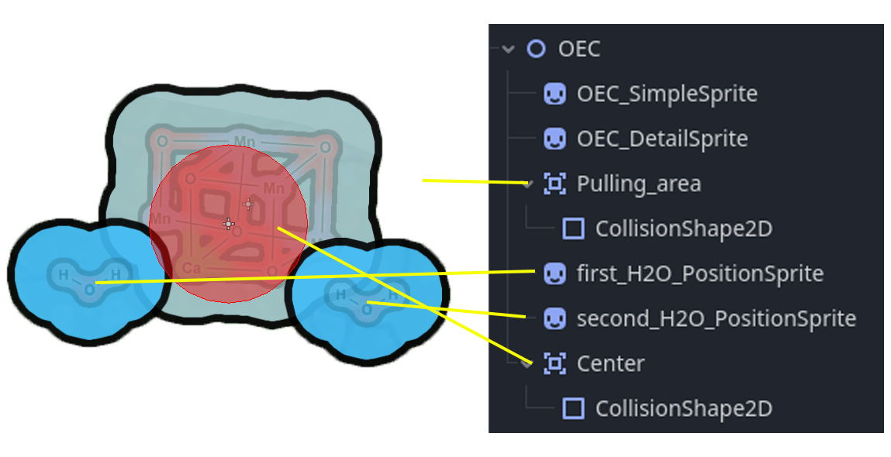

<h1 align="center">Oxygen-evolving complex (OEC)</h1>

 
  The oxygen-evolving complex is the Mn4CaO5 cluster within photosystem II. It is the very molecule that  binds and de-electronises water to provide electrons for the photosynthetic
  electron transfer chain. Water de-electronation also  
  results in release of protons and O₂ inside the thylakoids.

 

  

<!-- 3) SIMULATED BEHAVIOR (four stacked rows; each row = image left, text right) -->
<table width="1000" align="center" cellspacing="0" cellpadding="6" border="0">
<!-- Title row (only here) -->
<tr>
<td colspan="2" align="center" width="1000" style="background-color:#111; color:white;">
<b>Simulated behavior</b>
</td>
</tr>

<!-- Row 1 -->
<tr>
<td width="400" valign="top" align="center">

</td>
<td width="600" valign="middle">

  <b>Step&nbsp;1 – Attraction:</b> text here
  

    
🔎

       
      <small>Source: Plant Physiology and Development (7th ed.) (p.272)</small>
  

</td>
</tr>

<!-- Row 2 -->
<tr>
<td width="400" valign="top" align="center">

</td>
<td width="600" valign="middle">

<b>Step&nbsp;2 – Locking:</b> Two waters reach the <code>Center</code>, pause physics, disable their
colliders, and smoothly lock to anchor positions.
<!-- source reveal -->

🔎

 
<small>Source: Plant physiology and development (7th edition) (page 272)</small> 

</td>
</tr>

<!-- Row 3 -->
<tr>
<td width="400" valign="top" align="center">

</td>
<td width="600" valign="middle">

<b>Step&nbsp;3 – Oxidation:</b> The routine <code>deelectronation_of_H2O()</code> runs in two steps per water
(H2O→OH→O), spawning electrons to the chain and protons to the lumen.
<!-- source reveal -->

🔎

 
<small>Source: Plant physiology and development (7th edition) (page 272)</small> 

</td>
</tr>

<!-- Row 4 -->
<tr>
<td width="400" valign="top" align="center">

</td>
<td width="600" valign="middle">

<b>Step&nbsp;4 – Release:</b> When both sites show O, monitoring resumes, atoms are freed as “O” bodies,
and nearby O’s are gently steered together to visualize O2 formation.
<!-- source reveal -->

🔎

 
<small>Source: Plant physiology and development (7th edition) (page 272)</small> 

</td>
</tr>
</table>

<!-- 4) AREAS & STATES (tree image preserved) -->
<table width="1000" align="center" cellspacing="0" cellpadding="6" border="0">
<tr>
<td align="center" style="background-color:#111; color:white;">
<b>Areas &amp; States</b>
</td>
</tr>
<tr>
<td align="center">

<small></small>

</td>
</tr>
</table>

<!-- 5) SCRIPT LINK -->
<table width="720" align="center" cellspacing="0" cellpadding="6" border="0">
<tr>
<td align="center" style="background-color:#111; color:white;">
<b>Script</b>
</td>
</tr>
<tr>
<td align="center">
<a href="../Project/Scripts/OEC.gd" target="_blank" rel="noopener noreferrer">
View the OEC.gd script →
</a>
</td>
</tr>
</table>
