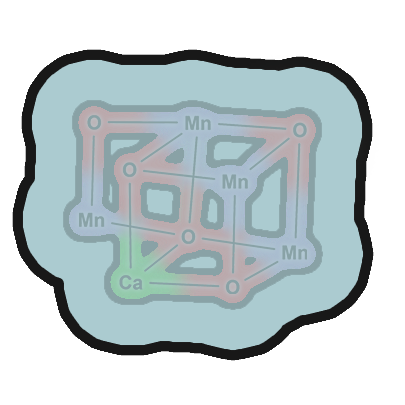

<!-- OEC.md (pure HTML, fixed 240px columns for GitHub) -->

<table align="center" cellspacing="0" cellpadding="6" border="0">
<tr>
  <th align="center">
    Oxygen-evolving complex (OEC) 
    
  </th>
  <th align="center">
    Description 
    
  </th>
  <th align="center">
    Behavior in simulation 
    
  </th>
</tr>

<tr>
  <!-- LEFT: image (240px) -->
  <td valign="top" align="center">
    <table width="240" cellspacing="0" cellpadding="6" border="1">
      <tr><th align="left">Oxygen-evolving complex (OEC)</th></tr>
      <tr>
        <td align="center">
          
          
<small>Part of Photosystem&nbsp;II; lumenal side</small>

        </td>
      </tr>
    </table>
  </td>

  <!-- CENTER: description (240px) -->
  <td valign="top" align="left">
    <table width="240" cellspacing="0" cellpadding="6" border="1">
      <tr><th align="left">Description</th></tr>
      <tr>
        <td>
          

            The Oxygen-evolving complex (OEC), also called the water-splitting complex,
            is the catalytic Mn4CaO5 cluster of Photosystem&nbsp;II (PSII).
            It oxidizes water, releasing molecular oxygen, protons, and electrons that
            feed the PSII electron transfer chain.
          

          
<b>Overall reaction:</b> <code>2 H₂O → O₂ + 4 H⁺ + 4 e⁻</code>

          

            The OEC advances through the Kok S-state cycle
            (S0→S1→S2→S3→S4→S0)
            driven by four PSII photon events. Electrons are transferred via tyrosine
            YZ to P680+.
          

        </td>
      </tr>
    </table>
  </td>

  <!-- RIGHT: behavior (240px) -->
  <td valign="top" align="left">
    <table width="240" cellspacing="0" cellpadding="6" border="1">
      <tr><th align="left">Behavior in Simulation</th></tr>
      <tr>
        <td>
          <ul>
            <li><b>Inputs:</b> 4 PSII photons; 2 × H₂O available.</li>
            <li><b>Outputs:</b> 1 × O₂, 4 × H⁺ to lumen, 4 e⁻ to PSII.</li>
            <li><b>Step:</b> Each PSII photon advances S-state by +1.</li>
            <li><b>Trigger:</b> At S4 consume 2 H₂O → spawn O₂ and 4 H⁺; deliver 4 e⁻; reset to S0.</li>
            <li><b>Counts:</b> +O₂, +H⁺, −H₂O accordingly.</li>
            <li><b>If H₂O &lt; 2:</b> Wait at S3/S4 until available.</li>
          </ul>
          
<b>Pseudo-flow:</b>

          <pre>
for each PSII_photon:
OEC.advance_S_state()
if OEC.at_S4() and H2O >= 2:
  consume(2 × H2O)
  spawn(1 × O2)
  spawn(4 × H+)
  deliver_electrons(4)
  OEC.reset_to_S0()
          </pre>
        </td>
      </tr>
    </table>
  </td>
</tr>
</table>
