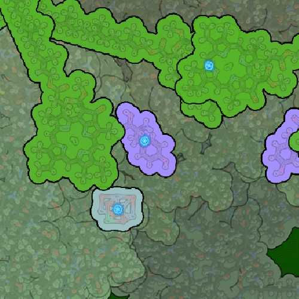
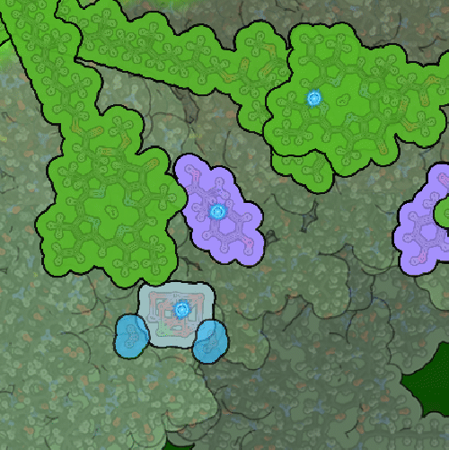

<h1 align="center">Oxygen-evolving complex (OEC)</h1>

 
The oxygen-evolving complex is an Mn4CaO5 cluster within photosystem II. It is the very molecule that 
binds and de-electronises water to provide electrons for the photosynthetic electron transfer chain.
  Water de-electronation also results in release of protons and O₂ inside the thylakoids.

 

  

<!-- SIMULATED BEHAVIOR -->
<table width="1000" align="center" cellspacing="0" cellpadding="6" border="0">
<tr>
<td colspan="2" align="center" style="background-color:#111; color:white;">
<b>Simulated behavior</b>
</td>
</tr>

<!-- TABLE 1 -->
<tr>
<td width="400" valign="top" align="center">

</td>
<td width="600" valign="middle">

<b>Binding of H₂O:</b> Two H₂O molecules bind to the oxygen-evolving complex.
<a href="SOURCES.md##two-h₂o-molecules-bind-to-the-oxygen-evolving-complex">🔎</a>

</td>
</tr>

<!-- TABLE 2 -->
<tr>
<td width="400" valign="top" align="center">

</td>
<td width="600" valign="middle">

<b>H₂O splitting:</b> 

When the central chlorophyll pair of photosystem II (P680) loses an electron, the resulting chain reaction of electron transfers ends with the splitting of H₂O in the oxygen-evolving complex.
<a href="SOURCES.md#when-the-central-chlorophyll-pair-of-photosystem-ii-p680-loses-an-electron-the-resulting-chain-reaction-of-electron-transfers-ends-with-the-splitting-of-h₂o-in-the-oxygen-evolving-complex">🔎</a>

Once having lost its electron, P680 receives a replacement from a nearby tyrosine molecule.
<a href="SOURCES.md#once-having-lost-its-electron-p680-receives-a-replacement-from-a-nearby-tyrosine-molecule">🔎</a>

The oxygen-evolving complex then supplies an electron to that tyrosine.
<a href="SOURCES.md#the-oxygen-evolving-complex-then-supplies-an-electron-to-that-tyrosine">🔎</a>

Each time the OEC gives away an electron, it pulls one from its bound H₂O particles, resulting in a simultaneous release of a proton to the lumen.
<a href="SOURCES.md#oec-water-deelectronation">🔎</a>

</td>
</tr>
</table>

<!-- 4) AREAS & STATES -->
<table width="1000" align="center" cellspacing="0" cellpadding="6" border="0">
<tr>
<td align="center" style="background-color:#111; color:white;">
<b>Areas &amp; States</b>
</td>
</tr>
<tr>
<td align="center">

</td>
</tr>
</table>

<!-- 5) SCRIPT LINK -->
<table width="720" align="center" cellspacing="0" cellpadding="6" border="0">
<tr>
<td align="center" style="background-color:#111; color:white;">
<b>Script</b>
</td>
</tr>
<tr>
<td align="center">
<a href="../Project/Scripts/OEC.gd" target="_blank" rel="noopener noreferrer">
View the OEC.gd script →
</a>
</td>
</tr>
</table>
