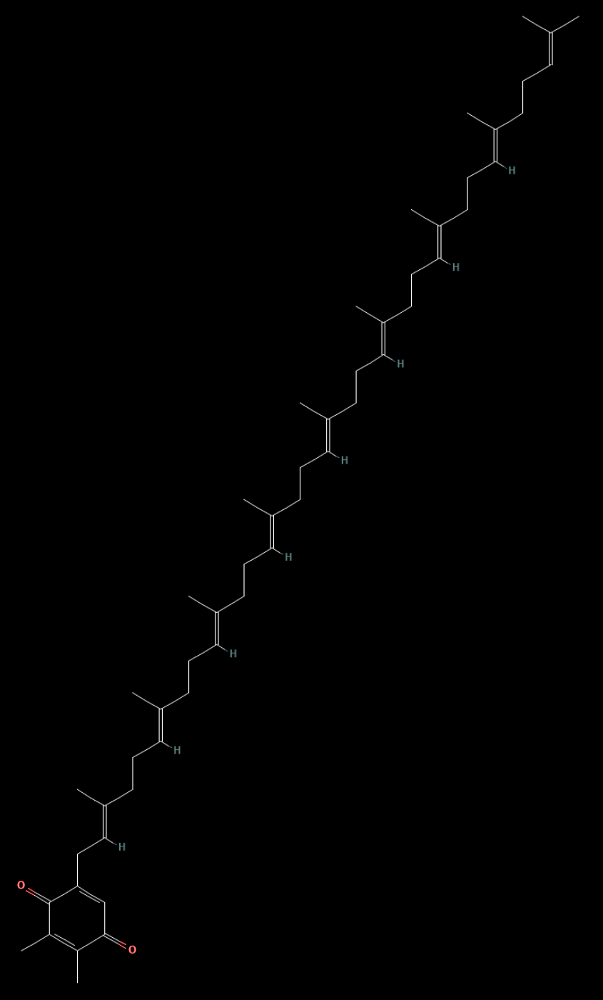
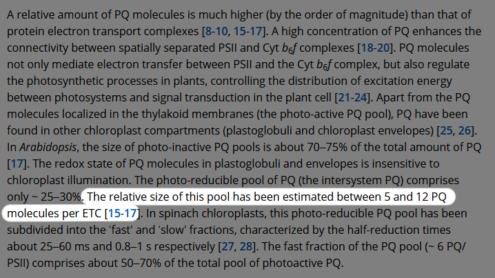
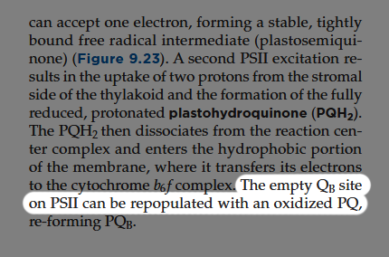

## Plastoquinone B

### Structure

  
🔎

  

    <a href="https://pubchem.ncbi.nlm.nih.gov/compound/5375177" target="_blank">
    https://pubchem.ncbi.nlm.nih.gov/compound/5375177
    </a>
  
 
  

    

### Location

🔎

Source: Photo-reducible plastoquinone pools in chloroplasts of Tradescentia plants acclimated to high and low light Igor S. Suslichenko, Alexander N. Tikhonov  
Page: 2 
Access: https://febs.onlinelibrary.wiley.com/doi/10.1002/1873-3468.13366?utm 

    

### function

 
 
 
 <small>Plastoquinone B node setup</small>  
 #Plastoquinone B (“PQB” or “plastohydroquinone”) is a non-polar molecule that shuttles electrons from photosystem II to cytochrome b6f.
   

    
🔎

     
    <small>Source: Plant physiology and development (7th edition) (page 268) </small>
     
    <small>Source: Plastoquinone In and Beyond Photosynthesis, Michel Havaux </small>

  

#Multiple plastoquinone Bs are located in the thylakoid membrane where they are able to move freely.
   

    
🔎

     
    <small>Source: Photo-reducible plastoquinone pools in chloroplasts of Tradescentia plants acclimated to high and low light
Igor S. Suslichenko, Alexander N. Tikhonov (https://febs.onlinelibrary.wiley.com/doi/10.1002/1873-3468.13366?utm)</small>

  

# When in an oxidised state plastoquinone B has the ability to bind to two specific sites.
   

    
🔎

     
    <small>Source: Plant physiology and development (7th edition) (page 266)</small> 
     
    <small>Source: Cytochrome b 6 f function and localization, phosphorylation state of thylakoid membrane proteins and consequences on cyclic electron flow</small> 

  

# Other being in the stromal side of photosystem II (QB-site) and the other in the stromal side of cytochrome b6f (Qi-site).
   

    
🔎

     
    <small>Source: Cytochrome b 6 f function and localization, phosphorylation state of thylakoid membrane proteins and consequences on cyclic electron flow</small> 
     
    <small>Source: Photosystem II: The Water-Splitting Enzyme of Photosynthesis, 
James Barber</small> 

  

Only while bound to these sites, can plastoquinone B accept an electron from a donor molecule.
   

    
🔎

!Source missing!

  

These two sites can only bind one plastoquinone B at a time.
   

    
🔎

    
    <small>Source: Photo-reducible plastoquinone pools in chloroplasts of Tradescentia plants acclimated to high and low light  
Igor S. Suslichenko, Alexander N. Tikhonov (https://febs.onlinelibrary.wiley.com/doi/10.1002/1873-3468.13366?utm)</small>

  

When plastoquinone B binds to the QB-site, it receives two electrons from plastoquinone A (structurally identical molecule, that is static inside photosystem II).
   

    
🔎

    
    <small>Source: Photo-reducible plastoquinone pools in chloroplasts of Tradescentia plants acclimated to high and low light  
Igor S. Suslichenko, Alexander N. Tikhonov (https://febs.onlinelibrary.wiley.com/doi/10.1002/1873-3468.13366?utm)</small>

  

Plastoquinone A can only transfer one electron a time.
   

    
🔎

    
    <small>Source: Photo-reducible plastoquinone pools in chloroplasts of Tradescentia plants acclimated to high and low light  
Igor S. Suslichenko, Alexander N. Tikhonov (https://febs.onlinelibrary.wiley.com/doi/10.1002/1873-3468.13366?utm)</small>

  

Once an electron is inside plastoquinone B, a proton from the stroma is pulled to plastoquinone B aswell.
   

    
🔎

    
    <small>Source: Photo-reducible plastoquinone pools in chloroplasts of Tradescentia plants acclimated to high and low light  
Igor S. Suslichenko, Alexander N. Tikhonov (https://febs.onlinelibrary.wiley.com/doi/10.1002/1873-3468.13366?utm)</small>

  

So in addition to the two electrons, also two protons are bound by plastoquinone B.
   

    
🔎

    
    <small>Source: Photo-reducible plastoquinone pools in chloroplasts of Tradescentia plants acclimated to high and low light  
Igor S. Suslichenko, Alexander N. Tikhonov (https://febs.onlinelibrary.wiley.com/doi/10.1002/1873-3468.13366?utm)</small>

  

Once fully reduced (two electrons and two protons), plastoquinone B dissociates from QB-site inside photosystem II and moves toward the lumenal side of cytochrome b6f into the quinone oxidation site (Qo-site).
   

    
🔎

    
    <small>Source: Photo-reducible plastoquinone pools in chloroplasts of Tradescentia plants acclimated to high and low light  
Igor S. Suslichenko, Alexander N. Tikhonov (https://febs.onlinelibrary.wiley.com/doi/10.1002/1873-3468.13366?utm)</small>

  

Once having reached the Qo-site, plastoquinone B releases the two electrons and protons.
   

    
🔎

    
    <small>Source: Photo-reducible plastoquinone pools in chloroplasts of Tradescentia plants acclimated to high and low light  
Igor S. Suslichenko, Alexander N. Tikhonov (https://febs.onlinelibrary.wiley.com/doi/10.1002/1873-3468.13366?utm)</small>

  

Protons are freed into the lumenal space, but the two electrons each take different routes inside cytochrome b6f.
   

    
🔎

    
    <small>Source: Photo-reducible plastoquinone pools in chloroplasts of Tradescentia plants acclimated to high and low light  
Igor S. Suslichenko, Alexander N. Tikhonov (https://febs.onlinelibrary.wiley.com/doi/10.1002/1873-3468.13366?utm)</small>

  

One goes through an iron-sulfur-cluster to heme f, while the other electron goes through heme b1 to heme b2.
   

    
🔎

    
    <small>Source: Photo-reducible plastoquinone pools in chloroplasts of Tradescentia plants acclimated to high and low light  
Igor S. Suslichenko, Alexander N. Tikhonov (https://febs.onlinelibrary.wiley.com/doi/10.1002/1873-3468.13366?utm)</small>

  

The plastoquinone B itself goes back to the thylakoid membrane where it can bind again to an unoccupied QB- or Qi-site.
   

    
🔎

    
    <small>Source: Photo-reducible plastoquinone pools in chloroplasts of Tradescentia plants acclimated to high and low light  
Igor S. Suslichenko, Alexander N. Tikhonov (https://febs.onlinelibrary.wiley.com/doi/10.1002/1873-3468.13366?utm)</small>

  

The electron inside heme f waits to be transferred to plastocyanin once one comes close enough.
   

    
🔎

    
    <small>Source: Photo-reducible plastoquinone pools in chloroplasts of Tradescentia plants acclimated to high and low light  
Igor S. Suslichenko, Alexander N. Tikhonov (https://febs.onlinelibrary.wiley.com/doi/10.1002/1873-3468.13366?utm)</small>

  

The electron inside heme b2 waits to be transferred by another plastoquinone B that binds to the Qi-site.
   

    
🔎

    
    <small>Source: Photo-reducible plastoquinone pools in chloroplasts of Tradescentia plants acclimated to high and low light  
Igor S. Suslichenko, Alexander N. Tikhonov (https://febs.onlinelibrary.wiley.com/doi/10.1002/1873-3468.13366?utm)</small>

  

Once plastoquinone B inside Qi-site has received two electrons from heme b2 and two protons from the stroma, it dissociates and moves to the Qo-site.
   

    
🔎

    
    <small>Source: Photo-reducible plastoquinone pools in chloroplasts of Tradescentia plants acclimated to high and low light  
Igor S. Suslichenko, Alexander N. Tikhonov (https://febs.onlinelibrary.wiley.com/doi/10.1002/1873-3468.13366?utm)</small>

  

The two protons are freed, and the two electrons take the previsouly described routes and the cycle starts anew.
   

    
🔎

    
    <small>Source: Photo-reducible plastoquinone pools in chloroplasts of Tradescentia plants acclimated to high and low light  
Igor S. Suslichenko, Alexander N. Tikhonov (https://febs.onlinelibrary.wiley.com/doi/10.1002/1873-3468.13366?utm)</small>

  

 
 <small>Plastoquinone B environment</small>  

 
 <small>Plastoquinone B binds to empty QB-site.</small>  

 
 <small>Plastoquinone B gains two electrons from plastoquinone A and two protons from stroma, then dissociates from QB-site and starts moving towards Qo-site.</small>  

 
 <small>Plastoquinone B reaches Qo-site and releases the two electrons and protons, and then returns to the membrane. The electrons take their different routes inside cytochrome b6f.</small>  

 
 <small>Another plastoquinone B is bound to the Qi-site and similarly waits to bind two electrons and two protons, and then dissociates towards Qo-site to release its electrons and protons in a similar fashion. The cycle is complete and starts again.</small>  

  

    
 View plastoquinone B's script 🔎

    
    extends CharacterBody2D

    ## variables----------------------------------------------------------------------------------------------------------------------------------------------------------------------------------

    # movement
    var speed = 50 # px/s
    var direction = Vector2(-1, -1) # x,y

    var returning_to_membrane = false
    var random_direction = Vector2()

    # electrons
    var electrons_that_are_pulled_towards_plastoquinone_B_center = Array()
    var electrons_that_entered_plastoquinone_B_center = Array()
    var plastoquinone_B_is_electronised = false

    # protons
    var protons_that_are_pulled_towards_plastoquinone_B_center = Array()
    var protons_that_entered_plastoquinone_B_center = Array()
    var plastoquinone_B_is_protonised = false

    # electron transfer proximity
    var iron_sulfur_cluster_is_close = false

    # node references
    @onready var QB_site: Node2D = $"../QB_site"
    @onready var Qi_site: Node2D = $"../Qi_site"
    @onready var Qo_site: Node2D = $"../Qo_site"
    @onready var Middle: Node2D = $"../Middle"
    @onready var Photosystem_II = $"../Photosystem_II"
    @onready var Cytochrome_b6f = $"../Cytochrome_b6f"

    ## Triggered functions--------------------------------------------------------------------------------------------------------------------------------------------------------

    ## When a proton or electron comes into center, mark it as belonging to plastoquinone B
    # triggered when any physicsbody enters the plastoquinone B Area2D "Plastoquinone_B_center"
    func when_body_enters_plastoquinone_B_center(body):
      # check if the body is a proton
      if body.is_in_group("proton") \
      # check if the proton is being pulled to the center
      and protons_that_are_pulled_towards_plastoquinone_B_center.has(body) == true \
      # check if the proton does not belong already to the plastoquinone B
      and protons_that_entered_plastoquinone_B_center.has(body) == false:
        # mark the proton as belonging to plastoquinone B
        protons_that_entered_plastoquinone_B_center.append(body)
      
        # check if there are two protons in plastoquinone B
        if protons_that_entered_plastoquinone_B_center.size() == 2:
          # mark the plastoquinone as fully protonated
          plastoquinone_B_is_protonised = true
        # try to release electrons to donor and protons to lumen
        releasing_of_electrons_from_plastoquinone_B() ## plastoquinone B 1st release signal (self electronised)

      # check if the body is an electron
      if body.is_in_group("electron") \
      # check if the electron is being pulled to the center
      and electrons_that_are_pulled_towards_plastoquinone_B_center.has(body) == true \
      # check if the electron does not belong already to the plastoquinone B
      and electrons_that_entered_plastoquinone_B_center.has(body) == false:
        # mark the electron as belonging to plastoquinone B
        electrons_that_entered_plastoquinone_B_center.append(body)
        
        # check if there are two electrons in plastoquinone B
        if electrons_that_entered_plastoquinone_B_center.size() == 2:
          # mark the plastoquinone as fully electronated
          plastoquinone_B_is_electronised = true

        # try to release electrons to donor and protons to lumen
        releasing_of_electrons_from_plastoquinone_B() ## plastoquinone B 1st release signal (self electronised)

    ## When a proton comes into pulling range, the plastoquinone B tries to pull it.
    # triggered when any physicsbody enters Area2D "Plastoquinone_B_proton_pulling_area"
    func when_body_enters_plastoquinone_B_proton_pulling_area(body):
      # check if the body is a proton
      if body.is_in_group("proton") == true \
      # check if there are less protons being pulled to plastoquinone B than electrons. Because plastoquinone B can pull a proton only if there is a corresponmding electron in the center.
      and protons_that_are_pulled_towards_plastoquinone_B_center.size() < electrons_that_entered_plastoquinone_B_center.size() \
      # check that the proton was not already being pulled
      and protons_that_are_pulled_towards_plastoquinone_B_center.has(body) == false \
      # check that the proton was not pulled by any other plastoquinone B
      and body.is_in_group("proton_claimed_by_plastoquinone_B") == false:
        # prevent other plastoquinone Bs from pulling the proton
        body.add_to_group("proton_claimed_by_plastoquinone_B")
        # append the proton to the array which has it's bodies pulled to the center of plastoquinone B
        protons_that_are_pulled_towards_plastoquinone_B_center.append(body)
        # set the protons collision layer and mask exclusively to layer 1, so that it wont collide with the membrane (layer 5), cytochrome b6f (layer 3) or photosystem II (layer 4)
        body.collision_layer = 1
        body.collision_mask = 1

    ## When the acceptor (iron-sulfur-cluster inside cytochrome b6f) comes into electron transfer range, plastoquinone B tries to release its electrons and protons
    # triggered when any physicsbody enters Area2D "Plastoquinone_B_electron_transfer_area"
    func when_body_enters_plastoquinone_B_electron_transfer_area(body):
      # check if the body is an iron-sulfur-cluster
      if body.is_in_group("iron_sulfur_cluster"):
        # mark the iron-sulfur-cluster as being in range of electron transfer
        iron_sulfur_cluster_is_close = true
        # try to release electron and protons from plasotquinone B
        releasing_of_electrons_from_plastoquinone_B() ## plastoquinone B 3rd release signal (acceptor comes in range)

    ## When the acceptor (iron-sulfur-cluster inside cytochrome b6f) goes out of electron transfer range, mark it as being out of range.
    func when_body_exits_plastoquinone_B_electron_transfer_area(body):
      if body.is_in_group("iron_sulfur_cluster"):
        iron_sulfur_cluster_is_close = false

    ## Release electrons and protons from plastoquinone B (called when plastoquinone B enters the Qo-site)
    # triggered in three situations: 1# when plastoquinone B is reduced 2# when acceptor is oxidised 3# when acceptor comes close
    func releasing_of_electrons_from_plastoquinone_B():
      # check if plastoquinone B is electronised
      if plastoquinone_B_is_electronised == true \
      # check if plastoquinone B is protonised
      and plastoquinone_B_is_protonised == true \
      # check if the acceptor #1 (iron-sulfur cluster) is not electronised
      and Cytochrome_b6f.iron_sulfur_cluster_is_electronised == false \
      # check if the acceptor #2 (heme b1) is not electronised
      and Cytochrome_b6f.heme_b1_is_electronised == false \
      # check that acceptor #1 (iron-sulfur cluster) is not already pulling an electron
      and Cytochrome_b6f.electrons_that_are_pulled_towards_iron_sulfur_cluster_center.size() < 1 \
      # check that acceptor #2 (heme b1) is not already pulling an electron
      and Cytochrome_b6f.electrons_that_are_pulled_towards_heme_b1_center.size() < 1 \
      # check that acceptor #1 is close enough for electron transfer
      and iron_sulfur_cluster_is_close == true:
        # select first electron from plastoquinone B
        var electron1 = electrons_that_are_pulled_towards_plastoquinone_B_center[0]
        # select second electron from plastoquinone B
        var electron2 = electrons_that_are_pulled_towards_plastoquinone_B_center[1]
        # assign first electron to be pulled by acceptor #1 (iron-sulfur cluster)
        Cytochrome_b6f.electrons_that_are_pulled_towards_iron_sulfur_cluster_center.append(electron1)
        # assign second electron to be pulled by acceptor #2 (heme b1)
        Cytochrome_b6f.electrons_that_are_pulled_towards_heme_b1_center.append(electron2)
        # stop pulling first electron to plastoquinone B
        electrons_that_are_pulled_towards_plastoquinone_B_center.erase(electron1)
        # stop pulling second electron to plastoquinone B
        electrons_that_are_pulled_towards_plastoquinone_B_center.erase(electron2)
        # first electron no longer belongs to plastoquinone B
        electrons_that_entered_plastoquinone_B_center.erase(electron1)
        # second electron no longer belongs to plastoquinone B
        electrons_that_entered_plastoquinone_B_center.erase(electron2)
        # plastoquinone B is no longer electronised
        plastoquinone_B_is_electronised = false
        # select first proton from plastoquinone B
        var proton1 = protons_that_are_pulled_towards_plastoquinone_B_center[0]
        # select second proton from plastoquinone B
        var proton2 = protons_that_are_pulled_towards_plastoquinone_B_center[1]
        # stop pulling first proton to plastoquinone B
        protons_that_are_pulled_towards_plastoquinone_B_center.erase(proton1)
        # stop pulling second proton to plastoquinone B
        protons_that_are_pulled_towards_plastoquinone_B_center.erase(proton2)
        # first proton no longer belongs to plastoquinone B
        protons_that_entered_plastoquinone_B_center.erase(proton1)
        # second proton no longer belongs to plastoquinone B
        protons_that_entered_plastoquinone_B_center.erase(proton2)
        # first proton is released from PQB ownership and can now be pulled by others
        proton1.remove_from_group("proton_claimed_by_plastoquinone_B")
        # second proton is released from PQB ownership and can now be pulled by others
        proton2.remove_from_group("proton_claimed_by_plastoquinone_B")
        # plastoquinone B is no longer protonised
        plastoquinone_B_is_protonised = false
        # signal to plastoquinone A (previous carrier) to release its electron
        Photosystem_II.releasing_of_electrons_from_plastoquinone_A() ## plastoquinone A 2nd release signal (acceptor comes in range)
        # mark plastoquinone B as returning to membrane
        returning_to_membrane = true
        # direct first proton out of the membrane via cytochrome b6f
        Cytochrome_b6f.protons_that_are_directed_out_of_the_membrane.append(proton1)
        # direct second proton out of the membrane via cytochrome b6f
        Cytochrome_b6f.protons_that_are_directed_out_of_the_membrane.append(proton2)
        # wait 1.5 seconds before clearing protons
        await get_tree().create_timer(1.5).timeout
        # remove first proton from directed list
        Cytochrome_b6f.protons_that_are_directed_out_of_the_membrane.erase(proton1)
        # remove second proton from directed list
        Cytochrome_b6f.protons_that_are_directed_out_of_the_membrane.erase(proton2)

    ## FIRST frame----------------------------------------------------------------------------------------------------------------------------------------------------------------------------------

    func connecting_of_when_body_enters_plastoquinone_B_center():
      $Plastoquinone_B_center.body_entered.connect(when_body_enters_plastoquinone_B_center)
    func connecting_of_when_body_enters_plastoquinone_B_proton_pulling_area():
      $Plastoquinone_B_proton_pulling_area.body_entered.connect(when_body_enters_plastoquinone_B_proton_pulling_area)
    func connecting_of_when_body_enters_plastoquinone_B_electron_transfer_area():
      $Plastoquinone_B_electron_transfer_area.body_entered.connect(when_body_enters_plastoquinone_B_electron_transfer_area)
    func connecting_of_when_body_exits_plastoquinone_B_electron_transfer_area():
      $Plastoquinone_B_electron_transfer_area.body_exited.connect(when_body_exits_plastoquinone_B_electron_transfer_area)

    ## EVERY frame------------------------------------------------------------------------------------------------------------------

    func _movement(delta):
      velocity = speed * direction
      var collision = move_and_collide(velocity * delta)
      if collision:
        var normal = collision.get_normal()
        direction = direction.bounce(normal).normalized()
        position = position - (velocity.normalized() * 0.5)

    ## Pulling logic for electrons
    func pulling_of_electrons_towards_plastoquinone_B_center():
      # apply for each electron inside the pulling array
      for body in electrons_that_are_pulled_towards_plastoquinone_B_center:
        # set pulling strength
        const LERP_STRENGTH = 0.55
        # set direction to be pulled in
        var target_direction = ($Plastoquinone_B_center.global_position - body.global_position).normalized()
        # change direction of electron each frame according to lerp strength
        body.direction = body.direction.lerp(target_direction, LERP_STRENGTH).normalized()

    ## Pulling logic for protons inside pulling area
    func pulling_of_protons_towards_plastoquinone_B_center():
      # apply for each electron inside the pulling array
      for body in protons_that_are_pulled_towards_plastoquinone_B_center:
        # set pulling strength
        const LERP_STRENGTH = 0.55
        # set direction to be pulled in
        var target_direction = ($Plastoquinone_B_center.global_position - body.global_position).normalized()
        # change direction of electron each frame according to lerp strength
        body.direction = body.direction.lerp(target_direction, LERP_STRENGTH).normalized()

    ## PLastoquinone B has a different direction depending on the listed factors below
      ## 1: if plastoquinone B is fully protonised and electronised. 															Direction = Qo-site
      ## 2: if plastoquinone B is not fully electronised nor fully protonised.												Direction = floating between Qi- and QB-site, and once comes in range of QB- or Qi-site can bind to it if site is unoccupied
      ## 3: if plastoquinone B is bound to QB-site or Qi-site																	Direction = QB- or Qi-site
      ## 4: when plastoquinone B releases its electron and protons on the Qo-site												Direction = point in between Qi- and QB-site called "Middle". (once it reaches the middle point, it will start to float freely between Qi- and QB-site and can bind to either if they are not occupied)
      ## !note! the logic of whether QB- and Qi-site is occupied is handled by photosystem II and cytochrome b6f  
    func shifting():
        # set strenght of directional change per frame
        const LERP_STRENGTH = 0.15
        # set strenght of vertical directional change (so that they keep inside membrane)
        const LERP_STRENGTH_Y = 0.15
        
        # check if plastoquinone B is fully protonised
        if plastoquinone_B_is_electronised and plastoquinone_B_is_protonised: 
          # set target direction to Qo-site
          var target_direction = (Qo_site.global_position - global_position).normalized()
          # change direction of plastoquinone B each frame according to lerp strength
          direction = direction.lerp(target_direction, LERP_STRENGTH).normalized()
        # check if plastoquinone B is not fully electronised
        elif electrons_that_entered_plastoquinone_B_center.size() > 0:
          # set a varying direction
          var target_direction = Vector2()
          # check if QB-site closer
          if global_position.distance_to(QB_site.global_position) < global_position.distance_to(Qi_site.global_position):
            # set direction to QB-site
            target_direction = (QB_site.global_position - global_position).normalized()
          # else: Qi-site must be closer
          else:
            # set direction to Qi-site
            target_direction = (Qi_site.global_position - global_position).normalized()
          # change the direction to which is closer
          direction = direction.lerp(target_direction, 1).normalized()
          # keep the vertical movement aproximately in the plane of the membrane
          position.y = lerp(position.y, Qi_site.global_position.y, LERP_STRENGTH_Y)
        # check if the plastoquinone B is returning from Q0-site
        elif returning_to_membrane == true:
          # set the direction to the "Middle"-node between QB- and Qi-site
          var target_direction = (Middle.global_position - global_position).normalized()
          direction = direction.lerp(target_direction, LERP_STRENGTH).normalized()
          # Vertical direction has been disabled to make for more natural movement
          #position.y = lerp(position.y, $"../Next_to_heme_b2".global_position.y, LERP_STRENGTH_Y)
        # check if the plastoquinone B is occupying the QB-site. 
        elif Photosystem_II.plastoquinone_Bs_that_are_close.has(self):
          # set direction to QB-site
          var target_direction = (QB_site.global_position - global_position).normalized()
          direction = direction.lerp(target_direction, 0.55).normalized()
          # keep the vertical movement on the level of membrane
          position.y = lerp(position.y, Qi_site.global_position.y, LERP_STRENGTH_Y)
        # check if the plastoquinone B is occupying the Qi-site
        elif Cytochrome_b6f.plastoquinone_Bs_that_are_close.has(self):
          # set direction to Qi-site
          var target_direction = (Qi_site.global_position - global_position).normalized()
          direction = direction.lerp(target_direction, 0.55).normalized()
          # keep the vertical movement on the level of membrane
          position.y = lerp(position.y, Qi_site.global_position.y, LERP_STRENGTH_Y)
        
        #else: plastoquinone B is not fully electronised nor protonised and it is not occupying a QB- or Qi-site (nor is it returing from the Qo-site)
        else:
          var target_direction = Vector2()
          # check if plastoquinone B has deviated 5 pixels horizontally from the membrane area between photosystem II (QB-site) or cytochrome b6f (Qi-site)
          if (self.global_position.x > Qi_site.global_position.x + 5
            or self.global_position.x < QB_site.global_position.x - 5
          ):
            # set the direction to the middle point between QB-site and Qi-site. so that it returns in the membrane and doesnt float inside photosystem II or cytochrome b6f
            target_direction = (Middle.global_position - global_position).normalized()
            direction = direction.lerp(target_direction, 0.5).normalized()
            position.y = lerp(position.y, Qi_site.global_position.y, LERP_STRENGTH_Y)
          # else: get a random direction every second (from constant timer) that is somewhere between QB-site and Qi-site
          else: 
            target_direction = random_direction
            direction = direction.lerp(target_direction, LERP_STRENGTH).normalized()
            position.y = lerp(position.y, Qi_site.global_position.y, LERP_STRENGTH_Y)

    func _on_constant_timer_timeout():
      ## !note! actually there are currently two groups of plastoquinone Bs. One is floating between the middle point and QB-site, the other group is floating between middle point and cytochrome b6f. This ensures that they are spread more evenly in the membrane. More elegant solution is needed.
      random_direction = (Middle.global_position.lerp(QB_site.global_position, randf()) - global_position).normalized()

    ## ------------------------------------------------------------------------------------------------------------------

    func _ready(): 
      var constant_timer = Timer.new()
      constant_timer.wait_time = 1.0  # seconds
      constant_timer.one_shot = false
      constant_timer.autostart = true
      add_child(constant_timer)
      constant_timer.timeout.connect(_on_constant_timer_timeout)

      add_to_group("plastoquinone_B")
      connecting_of_when_body_enters_plastoquinone_B_center()
      connecting_of_when_body_enters_plastoquinone_B_proton_pulling_area()
      connecting_of_when_body_enters_plastoquinone_B_electron_transfer_area()
      connecting_of_when_body_exits_plastoquinone_B_electron_transfer_area()

    func _physics_process(delta):

      _movement(delta)
      pulling_of_electrons_towards_plastoquinone_B_center()
      pulling_of_protons_towards_plastoquinone_B_center()
      shifting()

      
      

     
      
      
  Known issues 
  • Some plastoquinone B nodes have different scripts. They are divided to two groups that float in either the PSII side of the membrane or cytochrome b6f side of the membrane. A one-script solution would be best. 
  • Sometimes after releasing electrons and protons in the Qo-site, plastoquinone B suddenly moves either up or down for around 3 seconds before starting to move towards the membrane's "Middle"-point. 
  • Electrons and protons belonging to plasotquinone B are lagging behind because plastoquinone B moves too fast.

	