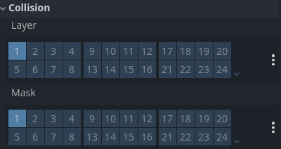

# Proton

## Structure

  
View structure source 🔎

  

    <a href="https://pubchem.ncbi.nlm.nih.gov/compound/Proton" target="_blank">
    https://pubchem.ncbi.nlm.nih.gov/compound/Proton
    </a>
  
 
  

    

## function

 
 
 <small>Proton node setup</small>  
  Proton is a positively charged particle that makes up the nuclei of atoms together with neutrally charged neutrons. 
   

    
🔎

     
    <small>Source: Wikipedia (https://en.wikipedia.org/wiki/Atom) </small>

  

Protons play a central role in photosynthesis where they are created inside the lumen with the oxidation of water.
   

    
🔎

     
    <small>Source: Plant physiology and development (7th edition) (page 264)</small>

  

Protons then flow through ATP-synthase which enables the enzyme to create ATP.
   

    
🔎

     
    <small>Source: Plant physiology and development (7th edition) (page 272)</small> 
  
 
  

   

    
View proton's script🔎

      extends CharacterBody2D
      
      var speed = 125
      var direction = Vector2(-1, -1)
      var rotation_speed = 2
      var rotation_direction = -1

      func _movement(delta):
        velocity = speed * direction
        rotation = rotation + (delta * rotation_speed * rotation_direction)
        var collision = move_and_collide(velocity * delta)
        if collision:
          var normal = collision.get_normal()
          direction = direction.bounce(normal).normalized()
          position = position - (velocity.normalized() * 0.0)
          rotation_direction = rotation_direction * (-1)

      func _ready():
        add_to_group("proton")

      func _physics_process(delta):
        _movement(delta)

  
 
   

  Known issues 
  • Proton speed is arbitrary

