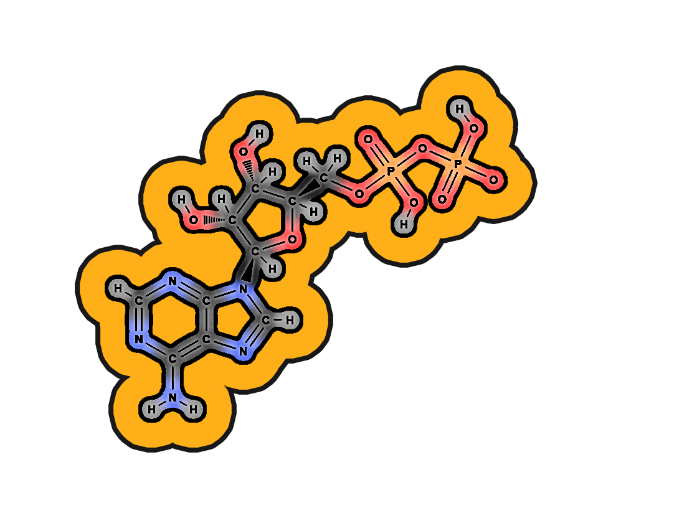
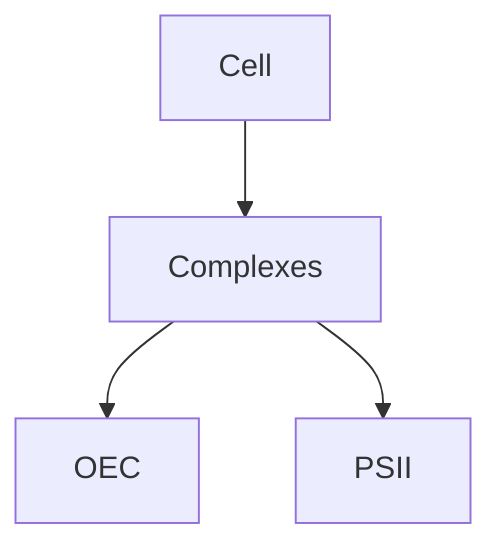

<!-- Banner -->


<!-- One-line intro -->
<div align="center">
  <div style="display:inline-block; max-width:900px;">
    ProjectMPB is an interactive simulation of photosynthesis developed at the University of Turku.<br>
    The goal is to provide an accurate, visually rich, and accessible tool for researchers and educators<br> to observe photosynthetic processes in silico.
  </div>
</div>

<br>

<!-- Buttons -->
<div align="center">
  <div style="display:inline-block;">
    <a href="https://example.com/docs" target="_blank" rel="noopener noreferrer" style="display:inline-block;">
      
    </a>
    <a href="https://example.com/docs" target="_blank" rel="noopener noreferrer" style="display:inline-block;">
      
    </a>
  </div>
</div>

<br><br>

<!-- Tutorial -->
<h1 align="center">How to control the simulation?</h1>

<table align="center">
  <tr>
    <td align="center"><p>Scroll to zoom</p></td>
    <td align="center"><p>Right click to<br>move camera</p></td>
    <td align="center"><p>Left click to<br>add particles</p></td>
  </tr>
  <tr>
    <td align="center"></td>
    <td align="center"></td>
    <td align="center"></td>
  </tr>
  <tr>
    <td colspan="3" align="center"><p>Adjust speed of particles using the Speed slider</p></td>
  </tr>
  <tr>
    <td colspan="3" align="center">
      
    </td>
  </tr>
</table>

<br><br><br>

<h1 align="center">Glossary of simulation components</h1>
<br>

<!-- PQB · Proton · OEC -->
<table align="center">
  <tr>
    <th align="center" width="250">Plastoquinone B</th>
    <th align="center" width="250">Proton</th>
    <th align="center" width="250">Oxygen evolving complex</th>
  </tr>
  <tr>
    <td align="center"></td>
    <td align="center"></td>
    <td align="center"></td>
  </tr>
  <tr>
    <td align="center" style="font-size:14px; line-height:1.45; padding:10px; vertical-align:top;">
      Plastoquinone B is a mobile electron carrier located in Photosystem II’s QB binding site. It accepts two electrons sequentially from the QA plastoquinone and then takes up two protons from the stroma. Once reduced to plastoquinol (PQH₂), it diffuses into the thylakoid membrane to deliver electrons and protons to the cytochrome b₆f complex. PQB is therefore a key link between light-driven charge separation in PSII and the proton gradient used for ATP synthesis.
      <br><a href="Documentation/Plastoquinone_B.md" target="_blank" rel="noopener noreferrer" style="display:inline-block; margin-top:6px; font-size:13px;">Read more →</a>
    </td>
    <td align="center" style="font-size:14px; line-height:1.45; padding:10px; vertical-align:top;">
      Protons are central to photosynthesis because their movement across the thylakoid membrane creates a proton gradient. This gradient is generated by the splitting of water at the oxygen-evolving complex and by proton pumping through cytochrome b₆f. The energy stored in the gradient drives ATP synthase, which produces ATP, the cell’s primary energy currency. Without protons, the chemiosmotic mechanism of photosynthesis would not function, and ATP formation would halt.
      <br><a href="Documentation/Proton.md" target="_blank" rel="noopener noreferrer" style="display:inline-block; margin-top:6px; font-size:13px;">Read more →</a>
    </td>
    <td align="center" style="font-size:14px; line-height:1.45; padding:10px; vertical-align:top;">
      The oxygen-evolving complex, also called the water-splitting complex, is bound to Photosystem II. It contains a cluster of four manganese ions, one calcium ion, and five oxygen atoms (Mn₄CaO₅ cluster). The OEC oxidizes two water molecules, releasing four protons into the lumen, four electrons to P680⁺, and one molecule of O₂ as a byproduct. This reaction is the only known biological source of atmospheric oxygen and is fundamental to life on Earth.
      <br><a href="Documentation/Oxygen-evolving_complex.md" target="_blank" rel="noopener noreferrer" style="display:inline-block; margin-top:6px; font-size:13px;">Read more →</a>
    </td>
  </tr>
</table>

<br><br>

<!-- Cyt b6f · ATP synthase · PSII -->
<table align="center">
  <tr>
    <th align="center" width="250">Cytochrome b₆f</th>
    <th align="center" width="250">ATP synthase</th>
    <th align="center" width="250">Photosystem II</th>
  </tr>
  <tr>
    <td align="center"></td>
    <td align="center"></td>
    <td align="center"></td>
  </tr>
  <tr>
    <td align="center" style="font-size:14px; line-height:1.45; padding:10px; vertical-align:top;">
      Cytochrome b₆f is a protein complex embedded in the thylakoid membrane that connects Photosystem II to Photosystem I. It accepts electrons from plastoquinol (PQH₂) and transfers them to plastocyanin via the Q-cycle mechanism. At the same time, it pumps additional protons from the stroma into the lumen, strengthening the proton gradient. This dual role makes cytochrome b₆f essential for both electron flow and ATP production.
      <br><a href="Documentation/Cytochrome_b6f.md" target="_blank" rel="noopener noreferrer" style="display:inline-block; margin-top:6px; font-size:13px;">Read more →</a>
    </td>
    <td align="center" style="font-size:14px; line-height:1.45; padding:10px; vertical-align:top;">
      ATP synthase is a rotary enzyme complex that produces ATP from ADP and inorganic phosphate. It is powered by the proton gradient established across the thylakoid membrane during photosynthetic electron transport. As protons flow back through its Fo subunit, the F₁ catalytic head rotates and drives phosphorylation. This process, known as photophosphorylation, provides the cell with usable chemical energy.
      <br><a href="Documentation/ATP_synthase.md" target="_blank" rel="noopener noreferrer" style="display:inline-block; margin-top:6px; font-size:13px;">Read more →</a>
    </td>
    <td align="center" style="font-size:14px; line-height:1.45; padding:10px; vertical-align:top;">
      Photosystem II is the first major protein complex of the light reactions of photosynthesis. It captures photons with its chlorophyll molecules and uses the energy to extract electrons from water via the oxygen-evolving complex. The excited electrons are transferred to plastoquinone, initiating the electron transport chain. Photosystem II is the only protein complex able to split water, releasing oxygen as a byproduct.
      <br><a href="Documentation/Photosystem_II.md" target="_blank" rel="noopener noreferrer" style="display:inline-block; margin-top:6px; font-size:13px;">Read more →</a>
    </td>
  </tr>
</table>

<br><br>

<!-- Plastocyanin · ATP · Water -->
<table align="center">
  <tr>
    <th align="center" width="250">Plastocyanin</th>
    <th align="center" width="250">ATP</th>
    <th align="center" width="250">Water</th>
  </tr>
  <tr>
    <td align="center"></td>
    <td align="center"></td>
    <td align="center"></td>
  </tr>
  <tr>
    <td align="center" style="font-size:14px; line-height:1.45; padding:10px; vertical-align:top;">
      Plastocyanin is a small copper-containing protein that shuttles electrons between cytochrome b₆f and Photosystem I. It operates in the thylakoid lumen and is essential for connecting the two photosystems. By carrying single electrons, plastocyanin ensures that the flow of charges remains continuous during light reactions. Without plastocyanin, Photosystem I would not receive the electrons needed for NADPH formation.
      <br><a href="Documentation/Plastocyanin.md" target="_blank" rel="noopener noreferrer" style="display:inline-block; margin-top:6px; font-size:13px;">Read more →</a>
    </td>
    <td align="center" style="font-size:14px; line-height:1.45; padding:10px; vertical-align:top;">
      ATP is the universal energy currency of the cell and a direct product of the light reactions of photosynthesis. It is synthesized by ATP synthase as protons flow back across the thylakoid membrane. In photosynthesis, ATP provides the chemical energy required for the Calvin cycle to fix carbon dioxide. Its rapid turnover makes ATP indispensable for sustaining cellular and metabolic processes.
      <br><a href="Documentation/ATP.md" target="_blank" rel="noopener noreferrer" style="display:inline-block; margin-top:6px; font-size:13px;">Read more →</a>
    </td>
    <td align="center" style="font-size:14px; line-height:1.45; padding:10px; vertical-align:top;">
      Water is the primary electron donor in oxygenic photosynthesis. At Photosystem II’s oxygen-evolving complex, two water molecules are split to release four protons, four electrons, and one oxygen molecule. The electrons replace those excited and lost from P680 chlorophyll, while the protons contribute to the lumenal proton gradient. This water-splitting reaction is the source of nearly all atmospheric oxygen on Earth.
      <br><a href="Documentation/Water.md" target="_blank" rel="noopener noreferrer" style="display:inline-block; margin-top:6px; font-size:13px;">Read more →</a>
    </td>
  </tr>
</table>

<br><br>

<!-- Photosystem I · Ferredoxin · FNR -->
<table align="center">
  <tr>
    <th align="center" width="250">Photosystem I</th>
    <th align="center" width="250">Ferredoxin</th>
    <th align="center" width="250">Ferredoxin–NADP reductase</th>
  </tr>
  <tr>
    <td align="center"></td>
    <td align="center"></td>
    <td align="center"></td>
  </tr>
  <tr>
    <td align="center" style="font-size:14px; line-height:1.45; padding:10px; vertical-align:top;">
      Photosystem I (PSI) uses P700 to drive electron transfer from plastocyanin to ferredoxin. It receives electrons from PSII via cytochrome b₆f and plastocyanin and generates the strong reductant needed for NADP⁺ reduction.
      <br><a href="Documentation/Photosystem_I.md" target="_blank" rel="noopener noreferrer" style="display:inline-block; margin-top:6px; font-size:13px;">Read more →</a>
    </td>
    <td align="center" style="font-size:14px; line-height:1.45; padding:10px; vertical-align:top;">
      Ferredoxin is a small stromal [2Fe–2S] protein that carries one electron at a time from PSI to FNR. It serves as a branch point between linear and cyclic electron flow with fast diffusion and tuned redox potential.
      <br><a href="Documentation/Ferredoxin.md" target="_blank" rel="noopener noreferrer" style="display:inline-block; margin-top:6px; font-size:13px;">Read more →</a>
    </td>
    <td align="center" style="font-size:14px; line-height:1.45; padding:10px; vertical-align:top;">
      Ferredoxin–NADP reductase (FNR) is a flavoprotein (FAD) that reduces NADP⁺ to NADPH using electrons from ferredoxin. It associates with the thylakoid membrane or stroma, supplying reductant for the Calvin cycle.
      <br><a href="Documentation/Ferredoxin-NADP_reductase.md" target="_blank" rel="noopener noreferrer" style="display:inline-block; margin-top:6px; font-size:13px;">Read more →</a>
    </td>
  </tr>
</table>

<br><br>

<!-- NADP · ADP · CO2 -->
<table align="center">
  <tr>
    <th align="center" width="250">NADP⁺</th>
    <th align="center" width="250">ADP</th>
    <th align="center" width="250">CO₂</th>
  </tr>
  <tr>
    <td align="center"></td>
    <td align="center"></td>
    <td align="center"></td>
  </tr>
  <tr>
    <td align="center" style="font-size:14px; line-height:1.45; padding:10px; vertical-align:top;">
      NADP⁺ is the terminal electron acceptor of the light reactions and is reduced to NADPH by FNR. It carries a hydride and fuels anabolic reductions in the Calvin cycle.
      <br><a href="Documentation/NADP.md" target="_blank" rel="noopener noreferrer" style="display:inline-block; margin-top:6px; font-size:13px;">Read more →</a>
    </td>
    <td align="center" style="font-size:14px; line-height:1.45; padding:10px; vertical-align:top;">
      ADP is phosphorylated by ATP synthase during photophosphorylation to form ATP, powered by the proton-motive force across the thylakoid membrane.
      <br><a href="Documentation/ADP.md" target="_blank" rel="noopener noreferrer" style="display:inline-block; margin-top:6px; font-size:13px;">Read more →</a>
    </td>
    <td align="center" style="font-size:14px; line-height:1.45; padding:10px; vertical-align:top;">
      CO₂ is the inorganic carbon source fixed by RuBisCO in the Calvin cycle; one CO₂ reacts with RuBP to form two 3-phosphoglycerate molecules.
      <br><a href="Documentation/CO2.md" target="_blank" rel="noopener noreferrer" style="display:inline-block; margin-top:6px; font-size:13px;">Read more →</a>
    </td>
  </tr>
</table>

<br><br>

<!-- RuBisCO · RuBP · 3PGA -->
<table align="center">
  <tr>
    <th align="center" width="250">RuBisCO</th>
    <th align="center" width="250">Ribulose-1,5-bisphosphate (RuBP)</th>
    <th align="center" width="250">3-phosphoglyceric acid (3PGA)</th>
  </tr>
  <tr>
    <td align="center"></td>
    <td align="center"></td>
    <td align="center"></td>
  </tr>
  <tr>
    <td align="center" style="font-size:14px; line-height:1.45; padding:10px; vertical-align:top;">
      RuBisCO catalyzes carboxylation of RuBP and initiates CO₂ fixation; it also performs oxygenation leading to photorespiration.
      <br><a href="Documentation/RuBisCO.md" target="_blank" rel="noopener noreferrer" style="display:inline-block; margin-top:6px; font-size:13px;">Read more →</a>
    </td>
    <td align="center" style="font-size:14px; line-height:1.45; padding:10px; vertical-align:top;">
      RuBP is the five-carbon CO₂ acceptor that is regenerated in the Calvin cycle using ATP and NADPH.
      <br><a href="Documentation/RuBP.md" target="_blank" rel="noopener noreferrer" style="display:inline-block; margin-top:6px; font-size:13px;">Read more →</a>
    </td>
    <td align="center" style="font-size:14px; line-height:1.45; padding:10px; vertical-align:top;">
      3-PGA is the first stable product of RuBisCO carboxylation; it is phosphorylated and reduced to triose phosphates using ATP and NADPH.
      <br><a href="Documentation/3PGA.md" target="_blank" rel="noopener noreferrer" style="display:inline-block; margin-top:6px; font-size:13px;">Read more →</a>
    </td>
  </tr>
</table>

<br><br>

<!-- G3P · Phosphate · Tyrosine -->
<table align="center">
  <tr>
    <th align="center" width="250">Glyceraldehyde-3-phosphate</th>
    <th align="center" width="250">Phosphate (Pi)</th>
    <th align="center" width="250">Tyrosine</th>
  </tr>
  <tr>
    <td align="center"></td>
    <td align="center"></td>
    <td align="center"></td>
  </tr>
  <tr>
    <td align="center" style="font-size:14px; line-height:1.45; padding:10px; vertical-align:top;">
      G3P is the triose-phosphate product exported for sucrose synthesis or retained for starch; its export couples to Pi import.
      <br><a href="Documentation/G3P.md" target="_blank" rel="noopener noreferrer" style="display:inline-block; margin-top:6px; font-size:13px;">Read more →</a>
    </td>
    <td align="center" style="font-size:14px; line-height:1.45; padding:10px; vertical-align:top;">
      Inorganic phosphate recycles during ATP/ADP interconversion and triose-phosphate export; availability modulates photophosphorylation.
      <br><a href="Documentation/Phosphate.md" target="_blank" rel="noopener noreferrer" style="display:inline-block; margin-top:6px; font-size:13px;">Read more →</a>
    </td>
    <td align="center" style="font-size:14px; line-height:1.45; padding:10px; vertical-align:top;">
      In PSII, Tyr<sub>Z</sub> (D1-Y161) relays electrons from the OEC to P680⁺ via a tyrosyl radical during proton-coupled electron transfer.
      <br><a href="Documentation/Tyrosine.md" target="_blank" rel="noopener noreferrer" style="display:inline-block; margin-top:6px; font-size:13px;">Read more →</a>
    </td>
  </tr>
</table>

<br><br>

<!-- Chl a · Phylloquinone · Pheophytin -->
<table align="center">
  <tr>
    <th align="center" width="250">Chlorophyll a</th>
    <th align="center" width="250">Phylloquinone (A₁)</th>
    <th align="center" width="250">Pheophytin</th>
  </tr>
  <tr>
    <td align="center"></td>
    <td align="center"></td>
    <td align="center"></td>
  </tr>
  <tr>
    <td align="center" style="font-size:14px; line-height:1.45; padding:10px; vertical-align:top;">
      Chlorophyll a is the primary pigment that absorbs light and drives charge separation in PSI and PSII; antenna chlorophylls funnel excitation to P700 and P680.
      <br><a href="Documentation/Chlorophyll_a.md" target="_blank" rel="noopener noreferrer" style="display:inline-block; margin-top:6px; font-size:13px;">Read more →</a>
    </td>
    <td align="center" style="font-size:14px; line-height:1.45; padding:10px; vertical-align:top;">
      Phylloquinone (A₁) is an early electron acceptor in PSI between A₀ and the FX [4Fe–4S] cluster, tuned for efficient forward transfer.
      <br><a href="Documentation/Phylloquinone.md" target="_blank" rel="noopener noreferrer" style="display:inline-block; margin-top:6px; font-size:13px;">Read more →</a>
    </td>
    <td align="center" style="font-size:14px; line-height:1.45; padding:10px; vertical-align:top;">
      Pheophytin is a Mg-free chlorophyll that accepts the first stabilized electron from P680* in PSII and passes it rapidly to QA.
      <br><a href="Documentation/Pheophytin.md" target="_blank" rel="noopener noreferrer" style="display:inline-block; margin-top:6px; font-size:13px;">Read more →</a>
    </td>
  </tr>
</table>

<br><br>

<!-- PQ · Heme · [2Fe–2S] -->
<table align="center">
  <tr>
    <th align="center" width="250">Plastoquinone (PQ)</th>
    <th align="center" width="250">Heme</th>
    <th align="center" width="250">[2Fe–2S]</th>
  </tr>
  <tr>
    <td align="center"></td>
    <td align="center"></td>
    <td align="center"></td>
  </tr>
  <tr>
    <td align="center" style="font-size:14px; line-height:1.45; padding:10px; vertical-align:top;">
      Plastoquinone shuttles electrons and protons between PSII and cytochrome b₆f, cycling between PQ and PQH₂ and contributing protons to the lumen.
      <br><a href="Documentation/Plastoquinone.md" target="_blank" rel="noopener noreferrer" style="display:inline-block; margin-top:6px; font-size:13px;">Read more →</a>
    </td>
    <td align="center" style="font-size:14px; line-height:1.45; padding:10px; vertical-align:top;">
      Heme is the iron–porphyrin cofactor of cytochromes in b₆f, carrying electrons via Fe²⁺/Fe³⁺ cycling and setting midpoint potentials.
      <br><a href="Documentation/Heme.md" target="_blank" rel="noopener noreferrer" style="display:inline-block; margin-top:6px; font-size:13px;">Read more →</a>
    </td>
    <td align="center" style="font-size:14px; line-height:1.45; padding:10px; vertical-align:top;">
      [2Fe–2S] clusters serve as one-electron carriers in proteins like ferredoxin and the b₆f Rieske protein, with ligation tuning their redox potential.
      <br><a href="Documentation/2Fe-2S.md" target="_blank" rel="noopener noreferrer" style="display:inline-block; margin-top:6px; font-size:13px;">Read more →</a>
    </td>
  </tr>
</table>

<br><br>

<!-- [4Fe–4S] · Electron · Photon -->
<table align="center">
  <tr>
    <th align="center" width="250">[4Fe–4S]</th>
    <th align="center" width="250">Electron</th>
    <th align="center" width="250">Photon</th>
  </tr>
  <tr>
    <td align="center"></td>
    <td align="center"></td>
    <td align="center"></td>
  </tr>
  <tr>
    <td align="center" style="font-size:14px; line-height:1.45; padding:10px; vertical-align:top;">
      [4Fe–4S] clusters (FA and FB in PSI) relay electrons downstream of FX to ferredoxin and help drive reduction at the end of the chain.
      <br><a href="Documentation/4Fe-4S.md" target="_blank" rel="noopener noreferrer" style="display:inline-block; margin-top:6px; font-size:13px;">Read more →</a>
    </td>
    <td align="center" style="font-size:14px; line-height:1.45; padding:10px; vertical-align:top;">
      Electrons are the mobile charge carriers moved by light energy through pigments, quinones, metals and cofactors, ultimately reducing NADP⁺ to NADPH.
      <br><a href="Documentation/Electron.md" target="_blank" rel="noopener noreferrer" style="display:inline-block; margin-top:6px; font-size:13px;">Read more →</a>
    </td>
    <td align="center" style="font-size:14px; line-height:1.45; padding:10px; vertical-align:top;">
      Photons are quanta of light absorbed by pigments to create excited electronic states, initiating energy transfer and primary charge separation.
      <br><a href="Documentation/Photon.md" target="_blank" rel="noopener noreferrer" style="display:inline-block; margin-top:6px; font-size:13px;">Read more →</a>
    </td>
  </tr>
</table>

<br><br>

<!-- Choline phospholipid · O2 · Proton channel -->
<table align="center">
  <tr>
    <th align="center" width="250">Choline_fosfolipid</th>
    <th align="center" width="250">O₂</th>
    <th align="center" width="250">Proton_channel</th>
  </tr>
  <tr>
    <td align="center"></td>
    <td align="center"></td>
    <td align="center"></td>
  </tr>
  <tr>
    <td align="center" style="font-size:14px; line-height:1.45; padding:10px; vertical-align:top;">
      A choline-containing phospholipid contributes to thylakoid membrane structure and fluidity, supporting protein function and diffusion.
      <br><a href="Documentation/Choline_fosfolipid.md" target="_blank" rel="noopener noreferrer" style="display:inline-block; margin-top:6px; font-size:13px;">Read more →</a>
    </td>
    <td align="center" style="font-size:14px; line-height:1.45; padding:10px; vertical-align:top;">
      O₂ is released by PSII water oxidation into the lumen and then to the atmosphere; excess excitation can form reactive oxygen species from O₂.
      <br><a href="Documentation/O2.md" target="_blank" rel="noopener noreferrer" style="display:inline-block; margin-top:6px; font-size:13px;">Read more →</a>
    </td>
    <td align="center" style="font-size:14px; line-height:1.45; padding:10px; vertical-align:top;">
      The proton channel (Fo) of ATP synthase conducts H⁺ through the c-ring, converting proton-motive force into rotation that drives ATP formation.
      <br><a href="Documentation/Proton_channel.md" target="_blank" rel="noopener noreferrer" style="display:inline-block; margin-top:6px; font-size:13px;">Read more →</a>
    </td>
  </tr>
</table>


<br>
<br>

<table align="center">
  <tr>
    <th align="center" width="250">Plastocyanin</th>
    <th align="center" width="250">ATP</th>
    <th align="center" width="250">Water</th>
  </tr>
  <tr>
    <td align="center">
      
    </td>
    <td align="center">
      
    </td>
    <td align="center">
      
    </td>
  </tr>
  <tr>
    <td align="center" style="font-size:14px; line-height:1.45; padding:10px; vertical-align:top;">
      Plastocyanin is a small copper-containing protein that shuttles electrons between cytochrome b₆f and Photosystem I.
      It operates in the thylakoid lumen and is essential for connecting the two photosystems.
      By carrying single electrons, plastocyanin ensures that the flow of charges remains continuous during light reactions.
      Without plastocyanin, Photosystem I would not receive the electrons needed for NADPH formation.
    </td>
    <td align="center" style="font-size:14px; line-height:1.45; padding:10px; vertical-align:top;">
      ATP is the universal energy currency of the cell and a direct product of the light reactions of photosynthesis.
      It is synthesized by ATP synthase as protons flow back across the thylakoid membrane.
      In photosynthesis, ATP provides the chemical energy required for the Calvin cycle to fix carbon dioxide.
      Its rapid turnover makes ATP indispensable for sustaining cellular and metabolic processes.
    </td>
    <td align="center" style="font-size:14px; line-height:1.45; padding:10px; vertical-align:top;">
      Water is the primary electron donor in oxygenic photosynthesis.
      At Photosystem II’s oxygen-evolving complex, two water molecules are split to release four protons, four electrons, and one oxygen molecule.
      The electrons replace those excited and lost from P680 chlorophyll, while the protons contribute to the lumenal proton gradient.
      This water-splitting reaction is the source of nearly all atmospheric oxygen on Earth.
    </td>
  </tr>
</table>


<br><br><br><br><br><br><br><br><br><br><br><br><br><br><br><br><br><br><br><br><br><br><br><br><br><br><br><br><br><br><br><br><br><br><br><br><br><br><br><br><br><br><br><br><br><br><br><br><br><br><br><br><br><br><br><br><br><br><br><br><br><br><br><br><br><br><br><br><br><br><br><br><br><br><br><br><br><br><br><br>
## Maybe some table of content?
- [Overview](#overview)
- [Installation](installation.md)
- [Usage](usage.md)
- [Biology](biology/proteins.md)
  - [Protein Complexes](biology/complexes.md)
  - [Photosystems](biology/photosystems/PSI.md)

test

## Proteins and protein complexes.
- <span style="color:#32CD32">🌿 Oxygen-evolving complex.</span>
  - Important short description of OEC.
  - [Read more details](Documentation/OEC.md).
  - Go to chapter directly: [function](Documentation/OEC.md#function).
  - Code sniplet [L301](scenes/Level_7_scenes_and_scripts/Photosystem_II.gd#L301).
  - Code sniplet [L301–L601](scenes/Level_7_scenes_and_scripts/Photosystem_II.gd#L301-L601).
- <span style="color:#32CD32">🌿 Photosystem II.</span>
  - Whatever.

## Some ideas to make MD look nice.
### Example GDScript.

```gdscript
func test():
    print("Protein Complexes!")
```

```py
func test():
    print("Protein Complexes!")
```


<details>
  <summary>
    ✅ GDScript dropdown test.🔎
  </summary>

  <pre><code style="color: orange;">
def water_binding():
    print("OEC binds two water molecules!")
  </code></pre>
</details>


<details>
  <summary>
    ✅ GDScript dropdown test.🔎
  </summary>
  <gdlink>"Project/Scripts/OEC.gd"</gdlink>
```py
def water_binding():
    print("OEC binds two water molecules!")
```
</details>


### Example MD image placement.


### 📊 Some diagrams.
- Diagrams with **Mermaid** (supported on GitHub!)  

Example:



---
### Extra ideas:
- Glossary.md to keep links to each and every one element of cell biology.
---
