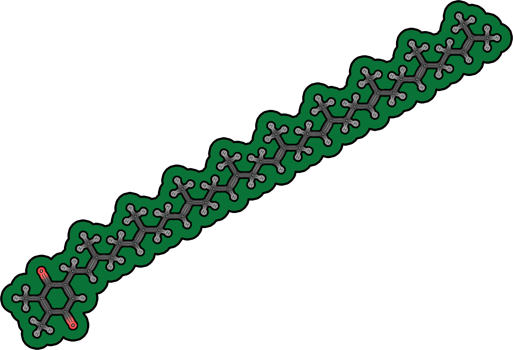
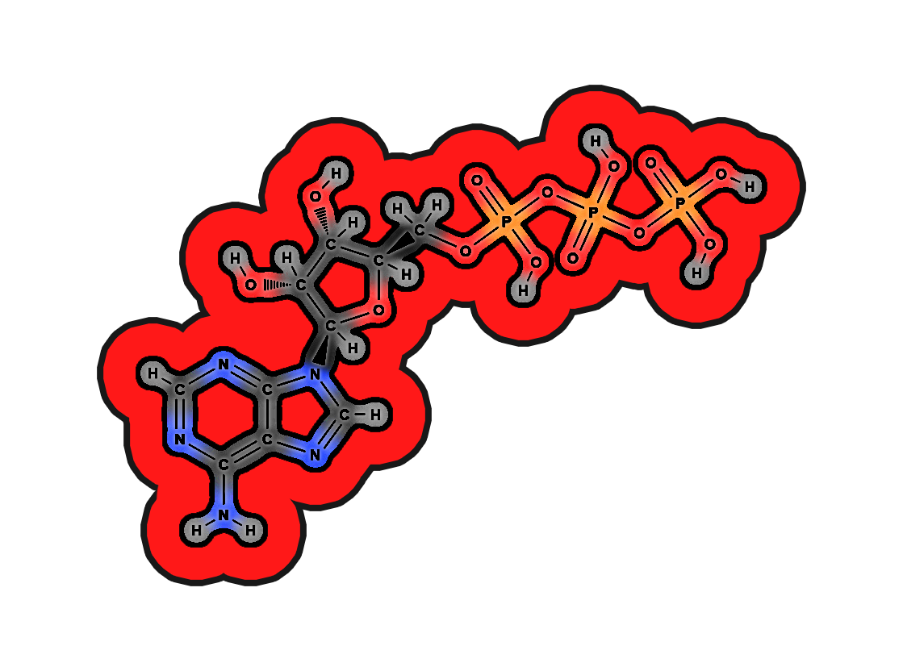
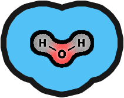
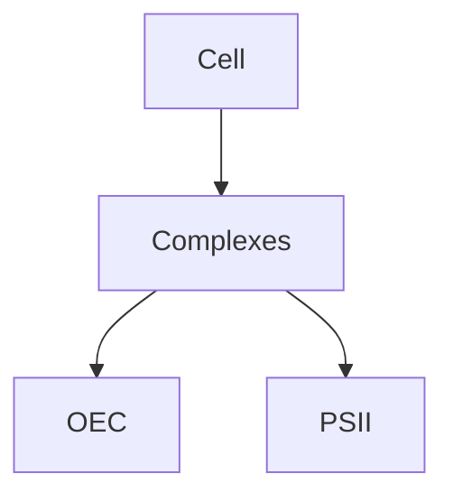

<div align="center">
<!--  <div style="display:inline-block; text-align:left; max-width:900px; font-size:20px;">  -->
  <div style="display:inline-block; max-width:900px;">
    ProjectMPB is an interactive simulation of photosynthesis developed at the University of Turku.<br>
    The goal is to provide an accurate, visually rich, and accessible tool for researchers and educators<br> to observe photosynthetic processes in silico.
  </div>
</div>

<br>

<div align="center">
  <div style="display:inline-block;">
    <a href="https://example.com/docs" target="_blank" rel="noopener noreferrer" style="display:inline-block;">
      
    </a>
    <a href="https://example.com/docs" target="_blank" rel="noopener noreferrer" style="display:inline-block;">
      
    </a>
  </div>
</div>

<br>
<br>
  
<h1 align="center">How to control the simulation?
<br>
<br>


<table align="center">
  <tr>
    <td align="center"><p>Scroll to zoom</p></td>
    <td align="center"><p>Right click to<br>move camera</p></td>
    <td align="center"><p>Left click to<br>add particles</p></td>
  </tr>
  <tr>
    <td align="center"></td>
    <td align="center"></td>
    <td align="center"></td>
  </tr>
  <tr>
    <td colspan="3" align="center"><p>Adjust speed of particles using the Speed slider</p></td>
  </tr>
  <tr>
    <td colspan="3" align="center">
      
    </td>
  </tr>
</table>

<br>
<br>
<br>

<h1 align="center">Glossary of simulation components
<br>
<br>

<table align="center">
  <tr>
    <td align="center">Plastoquinone B</td>
    <td align="center">Proton</td>
    <td align="center">Oxygen evolving complex</td>
  </tr>
  <tr>
    <td align="center"></td>
    <td align="center"></td>
    <td align="center"></td>
  </tr>
</table>
</h1>

<table align="center">
  <tr>
    <td align="center" width="300">
        Plastoquinone B is a mobile electron carrier located in Photosystem II’s QB binding site. It accepts two electrons sequentially from the QA plastoquinone and then takes up two protons from the stroma. Once reduced to plastoquinol (PQH₂), it diffuses into the thylakoid membrane to deliver electrons and protons to the cytochrome b₆f complex. PQB is therefore a key link between light-driven charge separation in PSII and the proton gradient used for ATP synthesis.
      </p>
    </td>
    <td align="center" width="300">
        Protons are central to photosynthesis because their movement across the thylakoid membrane creates a proton gradient. This gradient is generated by the splitting of water at the oxygen-evolving complex and by proton pumping through cytochrome b₆f. The energy stored in the gradient drives ATP synthase, which produces ATP, the cell’s primary energy currency. Without protons, the chemiosmotic mechanism of photosynthesis would not function, and ATP formation would halt.
      </p>
    </td>
    <td align="center" width="300">
        The oxygen-evolving complex, also called the water-splitting complex, is bound to Photosystem II. It contains a cluster of four manganese ions, one calcium ion, and five oxygen atoms (Mn₄CaO₅ cluster). The OEC oxidizes two water molecules, releasing four protons into the lumen, four electrons to P680⁺, and one molecule of O₂ as a byproduct. This reaction is the only known biological source of atmospheric oxygen and is fundamental to life on Earth.
      </p>
    </td>
  </tr>
</table>

<br>
<br>

<h1>
<table align="center">
  <tr>
    <td align="center">Cytochrome b₆f</td>
    <td align="center">ATP synthase</td>
    <td align="center">Photosystem II</td>
  </tr>
  <tr>
    <td align="center"></td>
    <td align="center"></td>
    <td align="center"></td>
  </tr>
</table>
</h1>

<table align="center">
  <tr>
    <td align="center" width="300">
        Cytochrome b₆f is a protein complex embedded in the thylakoid membrane that connects Photosystem II to Photosystem I. 
        It accepts electrons from plastoquinol (PQH₂) and transfers them to plastocyanin via the Q-cycle mechanism. 
        At the same time, it pumps additional protons from the stroma into the lumen, strengthening the proton gradient. 
        This dual role makes cytochrome b₆f essential for both electron flow and ATP production. 
    </td>
    <td align="center" width="300">
        ATP synthase is a rotary enzyme complex that produces ATP from ADP and inorganic phosphate. 
        It is powered by the proton gradient established across the thylakoid membrane during photosynthetic electron transport. 
        As protons flow back through its Fo subunit, the F₁ catalytic head rotates and drives phosphorylation. 
        This process, known as photophosphorylation, provides the cell with usable chemical energy. 
    </td>
    <td align="center" width="300">
        Photosystem II is the first major protein complex of the light reactions of photosynthesis. 
        It captures photons with its chlorophyll molecules and uses the energy to extract electrons from water via the oxygen-evolving complex. 
        The excited electrons are transferred to plastoquinone, initiating the electron transport chain. 
        Photosystem II is the only protein complex able to split water, releasing oxygen as a byproduct. 
    </td>
  </tr>
</table>

<br>
<br>

<h1>
<table align="center">
  <tr>
    <td align="center">Plastocyanin</td>
    <td align="center">ATP</td>
    <td align="center">Water</td>
  </tr>
  <tr>
    <td align="center"></td>
    <td align="center"></td>
    <td align="center"></td>
  </tr>
</table>
</h1>

<table align="center">
  <tr>
    <td align="center" width="300">
        Plastocyanin is a small copper-containing protein that shuttles electrons between cytochrome b₆f and Photosystem I. 
        It operates in the thylakoid lumen and is essential for connecting the two photosystems. 
        By carrying single electrons, plastocyanin ensures that the flow of charges remains continuous during light reactions. 
        Without plastocyanin, Photosystem I would not receive the electrons needed for NADPH formation. 
    </td>
    <td align="center" width="300">
        ATP is the universal energy currency of the cell and a direct product of the light reactions of photosynthesis. 
        It is synthesized by ATP synthase as protons flow back across the thylakoid membrane. 
        In photosynthesis, ATP provides the chemical energy required for the Calvin cycle to fix carbon dioxide. 
        Its rapid turnover makes ATP indispensable for sustaining cellular and metabolic processes. 
    </td>
    <td align="center" width="300">
        Water is the primary electron donor in oxygenic photosynthesis. 
        At Photosystem II’s oxygen-evolving complex, two water molecules are split to release four protons, four electrons, and one oxygen molecule. 
        The electrons replace those excited and lost from P680 chlorophyll, while the protons contribute to the lumenal proton gradient. 
        This water-splitting reaction is the source of nearly all atmospheric oxygen on Earth. 
    </td>
  </tr>
</table>


<br><br><br><br><br><br><br><br><br><br><br><br><br><br><br><br><br><br><br><br><br><br><br><br><br><br><br><br><br><br><br><br><br><br><br><br><br><br><br><br><br><br><br><br><br><br><br><br><br><br><br><br><br><br><br><br><br><br><br><br><br><br><br><br><br><br><br><br><br><br><br><br><br><br><br><br><br><br><br><br>
## Maybe some table of content?
- [Overview](#overview)
- [Installation](installation.md)
- [Usage](usage.md)
- [Biology](biology/proteins.md)
  - [Protein Complexes](biology/complexes.md)
  - [Photosystems](biology/photosystems/PSI.md)

test

## Proteins and protein complexes.
- <span style="color:#32CD32">🌿 Oxygen-evolving complex.</span>
  - Important short description of OEC.
  - [Read more details](Documentation/OEC.md).
  - Go to chapter directly: [function](Documentation/OEC.md#function).
  - Code sniplet [L301](scenes/Level_7_scenes_and_scripts/Photosystem_II.gd#L301).
  - Code sniplet [L301–L601](scenes/Level_7_scenes_and_scripts/Photosystem_II.gd#L301-L601).
- <span style="color:#32CD32">🌿 Photosystem II.</span>
  - Whatever.

## Some ideas to make MD look nice.
### Example GDScript.

```gdscript
func test():
    print("Protein Complexes!")
```

```py
func test():
    print("Protein Complexes!")
```


<details>
  <summary>
    ✅ GDScript dropdown test.🔎
  </summary>

  <pre><code style="color: orange;">
def water_binding():
    print("OEC binds two water molecules!")
  </code></pre>
</details>


<details>
  <summary>
    ✅ GDScript dropdown test.🔎
  </summary>
  <gdlink>"Project/Scripts/OEC.gd"</gdlink>
```py
def water_binding():
    print("OEC binds two water molecules!")
```
</details>


### Example MD image placement.


### 📊 Some diagrams.
- Diagrams with **Mermaid** (supported on GitHub!)  

Example:



---
### Extra ideas:
- Glossary.md to keep links to each and every one element of cell biology.
---
