<!-- Banner -->
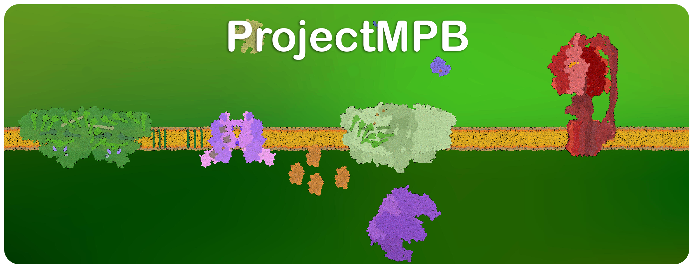

<!-- One-line intro -->
<div align="center">
  <div style="display:inline-block; max-width:900px;">
    ProjectMPB is an interactive simulation of photosynthesis developed at the University of Turku.<br>
    The goal is to provide an accurate, visually rich, and accessible tool for researchers and educators<br> to observe photosynthetic processes in silico.
  </div>
</div>

<br>

<!-- Buttons -->
<div align="center">
  <div style="display:inline-block;">
    <a href="https://example.com/docs" target="_blank" rel="noopener noreferrer" style="display:inline-block;">
      
    </a>
    <a href="https://example.com/docs" target="_blank" rel="noopener noreferrer" style="display:inline-block;">
      
    </a>
  </div>
</div>

<br><br>

<!-- Tutorial -->
<h1 align="center">How to control the simulation?</h1>

<table align="center">
  <tr>
    <td align="center"><p>Scroll to zoom</p></td>
    <td align="center"><p>Right click to move camera</p></td>
    <td align="center"><p>Left click to add particles</p></td>
  </tr>
  <tr> 
    <td align="center"></td>
    <td align="center"></td>
    <td align="center"></td>
  </tr>
  <tr>
    <td colspan="3" align="center"><p>Adjust speed of particles using the Speed slider</p></td>
  </tr>
  <tr>
    <td colspan="3" align="center">
      
    </td>
  </tr>
</table>

<br><br><br>

<h1 align="center">Documentation</h1>
<br>

<div style="max-width:640px;margin:0 auto;text-align:left;font-family:system-ui,-apple-system,Segoe UI,Roboto,Arial,sans-serif;">

<ul style="list-style:none;padding-left:0;margin:0;">

  <li style="display:flex;align-items:baseline;">
    <span>Photosystem_I</span>
    <span style="flex:1;border-bottom:1px dotted #8a8a8a;margin:0 .5em;transform:translateY(-2px);"></span>
    <span>1</span>
  </li>
  <ul style="list-style:none;margin:4px 0 0 20px;padding:0;">
    <li style="display:flex;align-items:baseline;">
      <span>Chlorophyll_A</span>
      <span style="flex:1;border-bottom:1px dotted #8a8a8a;margin:0 .5em;transform:translateY(-2px);"></span>
      <span>1</span>
    </li>
    <li style="display:flex;align-items:baseline;">
      <span>Phylloquinone</span>
      <span style="flex:1;border-bottom:1px dotted #8a8a8a;margin:0 .5em;transform:translateY(-2px);"></span>
      <span>1</span>
    </li>
    <li style="display:flex;align-items:baseline;">
      <span>[4Fe-4S]</span>
      <span style="flex:1;border-bottom:1px dotted #8a8a8a;margin:0 .5em;transform:translateY(-2px);"></span>
      <span>1</span>
    </li>
  </ul>

  <li style="display:flex;align-items:baseline;margin-top:6px;">
    <span>Photosystem_II</span>
    <span style="flex:1;border-bottom:1px dotted #8a8a8a;margin:0 .5em;transform:translateY(-2px);"></span>
    <span>1</span>
  </li>
  <ul style="list-style:none;margin:4px 0 0 20px;padding:0;">
    <li style="display:flex;align-items:baseline;">
      <span>Chlorophyll_A</span>
      <span style="flex:1;border-bottom:1px dotted #8a8a8a;margin:0 .5em;transform:translateY(-2px);"></span>
      <span>1</span>
    </li>
    <li style="display:flex;align-items:baseline;">
      <span>Pheophytin</span>
      <span style="flex:1;border-bottom:1px dotted #8a8a8a;margin:0 .5em;transform:translateY(-2px);"></span>
      <span>1</span>
    </li>
    <li style="display:flex;align-items:baseline;">
      <span>Plastoquinone A</span>
      <span style="flex:1;border-bottom:1px dotted #8a8a8a;margin:0 .5em;transform:translateY(-2px);"></span>
      <span>1</span>
    </li>
    <li style="display:flex;align-items:baseline;">
      <span>Oxygen evolving complex</span>
      <span style="flex:1;border-bottom:1px dotted #8a8a8a;margin:0 .5em;transform:translateY(-2px);"></span>
      <span>1</span>
    </li>
    <li style="display:flex;align-items:baseline;">
      <span>Tyrosine</span>
      <span style="flex:1;border-bottom:1px dotted #8a8a8a;margin:0 .5em;transform:translateY(-2px);"></span>
      <span>1</span>
    </li>
  </ul>

  <li style="display:flex;align-items:baseline;margin-top:6px;">
    <span>Cytochrome_b6f</span>
    <span style="flex:1;border-bottom:1px dotted #8a8a8a;margin:0 .5em;transform:translateY(-2px);"></span>
    <span>2</span>
  </li>
  <ul style="list-style:none;margin:4px 0 0 20px;padding:0;">
    <li style="display:flex;align-items:baseline;">
      <span>Heme</span>
      <span style="flex:1;border-bottom:1px dotted #8a8a8a;margin:0 .5em;transform:translateY(-2px);"></span>
      <span>2</span>
    </li>
    <li style="display:flex;align-items:baseline;">
      <span>[2Fe-2S]</span>
      <span style="flex:1;border-bottom:1px dotted #8a8a8a;margin:0 .5em;transform:translateY(-2px);"></span>
      <span>2</span>
    </li>
  </ul>

  <li style="display:flex;align-items:baseline;margin-top:6px;">
    <span>ATP-synthase</span>
    <span style="flex:1;border-bottom:1px dotted #8a8a8a;margin:0 .5em;transform:translateY(-2px);"></span>
    <span>2</span>
  </li>
  <ul style="list-style:none;margin:4px 0 0 20px;padding:0;">
    <li style="display:flex;align-items:baseline;">
      <span>Proton_channel</span>
      <span style="flex:1;border-bottom:1px dotted #8a8a8a;margin:0 .5em;transform:translateY(-2px);"></span>
      <span>2</span>
    </li>
  </ul>

  <li style="display:flex;align-items:baseline;margin-top:6px;">
    <span>Ferredoxin</span>
    <span style="flex:1;border-bottom:1px dotted #8a8a8a;margin:0 .5em;transform:translateY(-2px);"></span>
    <span>3</span>
  </li>
  <ul style="list-style:none;margin:4px 0 0 20px;padding:0;">
    <li style="display:flex;align-items:baseline;">
      <span>[2Fe-2S]</span>
      <span style="flex:1;border-bottom:1px dotted #8a8a8a;margin:0 .5em;transform:translateY(-2px);"></span>
      <span>3</span>
    </li>
  </ul>

  <li style="display:flex;align-items:baseline;margin-top:6px;">
    <span>ferredoxin-NADP-reductase</span>
    <span style="flex:1;border-bottom:1px dotted #8a8a8a;margin:0 .5em;transform:translateY(-2px);"></span>
    <span>3</span>
  </li>
  <li style="display:flex;align-items:baseline;">
    <span>Plastocyanin</span>
    <span style="flex:1;border-bottom:1px dotted #8a8a8a;margin:0 .5em;transform:translateY(-2px);"></span>
    <span>3</span>
  </li>
  <li style="display:flex;align-items:baseline;">
    <span>RuBisCo</span>
    <span style="flex:1;border-bottom:1px dotted #8a8a8a;margin:0 .5em;transform:translateY(-2px);"></span>
    <span>3</span>
  </li>

  <li style="display:flex;align-items:baseline;margin-top:6px;">
    <span>Membrane / lipid</span>
    <span style="flex:1;border-bottom:1px dotted #8a8a8a;margin:0 .5em;transform:translateY(-2px);"></span>
    <span>4</span>
  </li>
  <ul style="list-style:none;margin:4px 0 0 20px;padding:0;">
    <li style="display:flex;align-items:baseline;">
      <span>Choline_fosfolipid</span>
      <span style="flex:1;border-bottom:1px dotted #8a8a8a;margin:0 .5em;transform:translateY(-2px);"></span>
      <span>4</span>
    </li>
  </ul>

  <li style="display:flex;align-items:baseline;margin-top:6px;">
    <span>Small molecules &amp; carriers</span>
    <span style="flex:1;border-bottom:1px dotted #8a8a8a;margin:0 .5em;transform:translateY(-2px);"></span>
    <span>5</span>
  </li>
  <ul style="list-style:none;margin:4px 0 0 20px;padding:0;">
    <li style="display:flex;align-items:baseline;"><span>ATP</span><span style="flex:1;border-bottom:1px dotted #8a8a8a;margin:0 .5em;transform:translateY(-2px);"></span><span>5</span></li>
    <li style="display:flex;align-items:baseline;"><span>ADP</span><span style="flex:1;border-bottom:1px dotted #8a8a8a;margin:0 .5em;transform:translateY(-2px);"></span><span>5</span></li>
    <li style="display:flex;align-items:baseline;"><span>NADP</span><span style="flex:1;border-bottom:1px dotted #8a8a8a;margin:0 .5em;transform:translateY(-2px);"></span><span>5</span></li>
    <li style="display:flex;align-items:baseline;"><span>Phosphate</span><span style="flex:1;border-bottom:1px dotted #8a8a8a;margin:0 .5em;transform:translateY(-2px);"></span><span>5</span></li>
    <li style="display:flex;align-items:baseline;"><span>3-phosphoglyceric_acid (3PGA)</span><span style="flex:1;border-bottom:1px dotted #8a8a8a;margin:0 .5em;transform:translateY(-2px);"></span><span>5</span></li>
    <li style="display:flex;align-items:baseline;"><span>Glyceraldehyde 3-phosphate</span><span style="flex:1;border-bottom:1px dotted #8a8a8a;margin:0 .5em;transform:translateY(-2px);"></span><span>5</span></li>
    <li style="display:flex;align-items:baseline;"><span>ribulose-1,5-bisphosphate (RuBP)</span><span style="flex:1;border-bottom:1px dotted #8a8a8a;margin:0 .5em;transform:translateY(-2px);"></span><span>5</span></li>
    <li style="display:flex;align-items:baseline;"><span>Ribose-1,5-bisphosphate</span><span style="flex:1;border-bottom:1px dotted #8a8a8a;margin:0 .5em;transform:translateY(-2px);"></span><span>5</span></li>
    <li style="display:flex;align-items:baseline;"><span>CO2</span><span style="flex:1;border-bottom:1px dotted #8a8a8a;margin:0 .5em;transform:translateY(-2px);"></span><span>5</span></li>
    <li style="display:flex;align-items:baseline;"><span>H2O</span><span style="flex:1;border-bottom:1px dotted #8a8a8a;margin:0 .5em;transform:translateY(-2px);"></span><span>5</span></li>
    <li style="display:flex;align-items:baseline;"><span>O2</span><span style="flex:1;border-bottom:1px dotted #8a8a8a;margin:0 .5em;transform:translateY(-2px);"></span><span>5</span></li>
    <li style="display:flex;align-items:baseline;"><span>Electron</span><span style="flex:1;border-bottom:1px dotted #8a8a8a;margin:0 .5em;transform:translateY(-2px);"></span><span>5</span></li>
    <li style="display:flex;align-items:baseline;"><span>Proton</span><span style="flex:1;border-bottom:1px dotted #8a8a8a;margin:0 .5em;transform:translateY(-2px);"></span><span>5</span></li>
    <li style="display:flex;align-items:baseline;"><span>Photon</span><span style="flex:1;border-bottom:1px dotted #8a8a8a;margin:0 .5em;transform:translateY(-2px);"></span><span>5</span></li>
  </ul>

  <li style="display:flex;align-items:baseline;margin-top:6px;">
    <span>Utility / UI (not biological structure)</span>
    <span style="flex:1;border-bottom:1px dotted #8a8a8a;margin:0 .5em;transform:translateY(-2px);"></span>
    <span>6</span>
  </li>
  <ul style="list-style:none;margin:4px 0 0 20px;padding:0;">
    <li style="display:flex;align-items:baseline;">
      <span>Arrow</span>
      <span style="flex:1;border-bottom:1px dotted #8a8a8a;margin:0 .5em;transform:translateY(-2px);"></span>
      <span>6</span>
    </li>
    <li style="display:flex;align-items:baseline;">
      <span>Battery_level_indicator</span>
      <span style="flex:1;border-bottom:1px dotted #8a8a8a;margin:0 .5em;transform:translateY(-2px);"></span>
      <span>6</span>
    </li>
  </ul>

</ul>


</div>


<!-- Glossary (alphabetical order; all images use *_SimpleSprite.png) -->

<!-- [2Fe–2S] · [4Fe–4S] · 3PGA -->
<table align="center">
  <tr>
    <th align="center" width="250">[2Fe–2S]</th>
    <th align="center" width="250">[4Fe–4S]</th>
    <th align="center" width="250">3-phosphoglyceric acid (3PGA)</th>
  </tr>
  <tr>
    <td align="center"></td>
    <td align="center"></td>
    <td align="center"></td>
  </tr>
  <tr>
    <td align="center" style="font-size:14px; line-height:1.45; padding:10px; vertical-align:top;">
      [2Fe–2S] clusters act as one-electron carriers in proteins such as ferredoxin and the Rieske protein of b₆f. Coordination by cysteine and histidine residues tunes their midpoint potentials. They enable fast, reversible electron transfer between protein partners. These clusters are crucial nodes in both linear and cyclic electron flow.
      <br><a href="Documentation/2Fe-2S.md" target="_blank" rel="noopener noreferrer" style="display:inline-block; margin-top:6px; font-size:13px;">Read more →</a>
    </td>
    <td align="center" style="font-size:14px; line-height:1.45; padding:10px; vertical-align:top;">
      [4Fe–4S] clusters FA and FB within PSI relay electrons from FX to ferredoxin. The cubane structure supports rapid electron tunneling with minimal reorganization energy. Their potentials help drive the reduction at the end of the chain. This positioning ensures efficient delivery to ferredoxin and onward to FNR.
      <br><a href="Documentation/4Fe-4S.md" target="_blank" rel="noopener noreferrer" style="display:inline-block; margin-top:6px; font-size:13px;">Read more →</a>
    </td>
    <td align="center" style="font-size:14px; line-height:1.45; padding:10px; vertical-align:top;">
      3-phosphoglycerate (3-PGA) is the first stable product of RuBisCO carboxylation. It is phosphorylated by phosphoglycerate kinase using ATP to form 1,3-bisphosphoglycerate. Then it is reduced by NADPH to glyceraldehyde-3-phosphate in the Calvin cycle. Thus 3-PGA connects carbon fixation to triose-phosphate production for export or starch synthesis.
      <br><a href="Documentation/3PGA.md" target="_blank" rel="noopener noreferrer" style="display:inline-block; margin-top:6px; font-size:13px;">Read more →</a>
    </td>
  </tr>
</table>

<br><br>

<!-- ADP · ATP · ATP synthase -->
<table align="center">
  <tr>
    <th align="center" width="250">ADP</th>
    <th align="center" width="250">ATP</th>
    <th align="center" width="250">ATP synthase</th>
  </tr>
  <tr>
    <td align="center">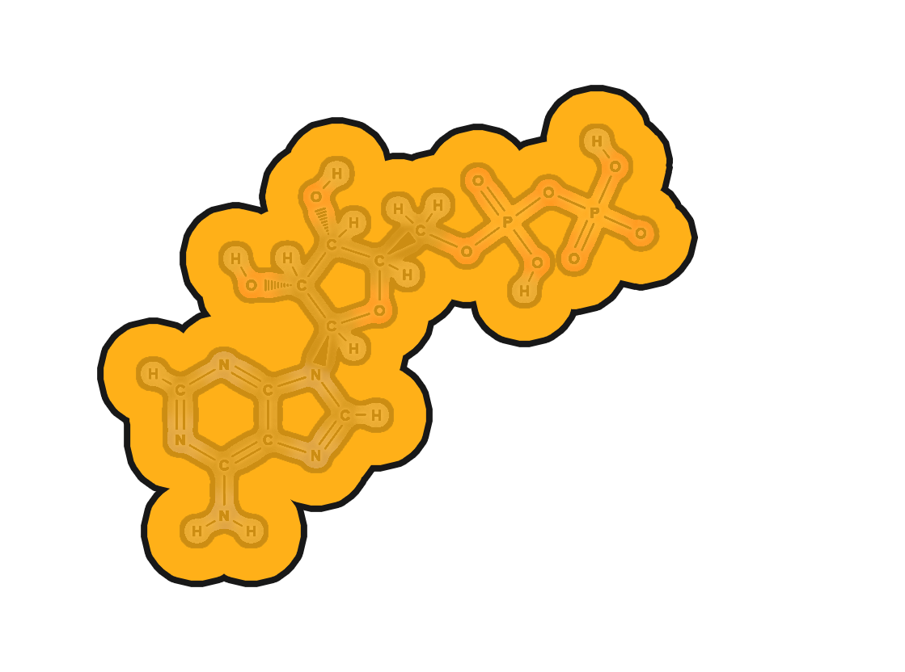</td>
    <td align="center"></td>
    <td align="center"></td>
  </tr>
  <tr>
    <td align="center" style="font-size:14px; line-height:1.45; padding:10px; vertical-align:top;">
      ADP is phosphorylated by ATP synthase during photophosphorylation to form ATP. The energy comes from the proton-motive force generated by water oxidation and cytochrome b₆f activity. ADP/ATP interconversion links electron transport to carbon assimilation and metabolite export. Stromal ADP availability and Pi recycling regulate the rate of ATP production.
      <br><a href="Documentation/ADP.md" target="_blank" rel="noopener noreferrer" style="display:inline-block; margin-top:6px; font-size:13px;">Read more →</a>
    </td>
    <td align="center" style="font-size:14px; line-height:1.45; padding:10px; vertical-align:top;">
      ATP is the universal energy currency produced during the light reactions of photosynthesis. ATP synthase uses the proton-motive force across the thylakoid membrane to phosphorylate ADP and Pi. The mechanical rotation of the enzyme’s FoF₁ subunits is coupled to chemical bond formation. The ATP generated powers carbon fixation and many other energy-requiring steps in the chloroplast.
      <br><a href="Documentation/ATP.md" target="_blank" rel="noopener noreferrer" style="display:inline-block; margin-top:6px; font-size:13px;">Read more →</a>
    </td>
    <td align="center" style="font-size:14px; line-height:1.45; padding:10px; vertical-align:top;">
      ATP synthase is a rotary enzyme complex that produces ATP from ADP and inorganic phosphate. It is powered by the proton gradient established across the thylakoid membrane during photosynthetic electron transport. As protons flow back through its Fo subunit, the F₁ catalytic head rotates and drives phosphorylation. This process, known as photophosphorylation, provides the cell with usable chemical energy.
      <br><a href="Documentation/ATP_synthase.md" target="_blank" rel="noopener noreferrer" style="display:inline-block; margin-top:6px; font-size:13px;">Read more →</a>
    </td>
  </tr>
</table>

<br><br>

<!-- Choline_fosfolipid · Chlorophyll a · CO₂ -->
<table align="center">
  <tr>
    <th align="center" width="250">Choline_fosfolipid</th>
    <th align="center" width="250">Chlorophyll a</th>
    <th align="center" width="250">CO₂</th>
  </tr>
  <tr>
    <td align="center"></td>
    <td align="center"></td>
    <td align="center"></td>
  </tr>
  <tr>
    <td align="center" style="font-size:14px; line-height:1.45; padding:10px; vertical-align:top;">
      A choline-containing phospholipid contributes to thylakoid membrane structure and fluidity. The bilayer environment modulates diffusion of quinones and mobility of protein complexes. It helps support proper folding and stability of embedded photosynthetic complexes. Membrane composition therefore influences efficiency and photoprotection.
      <br><a href="Documentation/Choline_fosfolipid.md" target="_blank" rel="noopener noreferrer" style="display:inline-block; margin-top:6px; font-size:13px;">Read more →</a>
    </td>
    <td align="center" style="font-size:14px; line-height:1.45; padding:10px; vertical-align:top;">
      Chlorophyll a is the primary pigment that absorbs light and drives charge separation in both photosystems. It forms the special pair P680 in PSII and P700 in PSI. Antenna chlorophylls transfer excitation energy to these reaction centers via excitonic coupling. Its spectral properties define much of the action spectrum of oxygenic photosynthesis.
      <br><a href="Documentation/Chlorophyll_a.md" target="_blank" rel="noopener noreferrer" style="display:inline-block; margin-top:6px; font-size:13px;">Read more →</a>
    </td>
    <td align="center" style="font-size:14px; line-height:1.45; padding:10px; vertical-align:top;">
      CO₂ is the inorganic carbon source fixed by RuBisCO in the Calvin cycle. One molecule of CO₂ combines with RuBP to form two molecules of 3-phosphoglycerate. Its assimilation depends on stomatal conductance, Rubisco kinetics, and chloroplast energy status. Fixed carbon is subsequently reduced using ATP and NADPH generated by the light reactions.
      <br><a href="Documentation/CO2.md" target="_blank" rel="noopener noreferrer" style="display:inline-block; margin-top:6px; font-size:13px;">Read more →</a>
    </td>
  </tr>
</table>

<br><br>

<!-- Cytochrome b₆f · Electron · Ferredoxin -->
<table align="center">
  <tr>
    <th align="center" width="250">Cytochrome b₆f</th>
    <th align="center" width="250">Electron</th>
    <th align="center" width="250">Ferredoxin</th>
  </tr>
  <tr>
    <td align="center">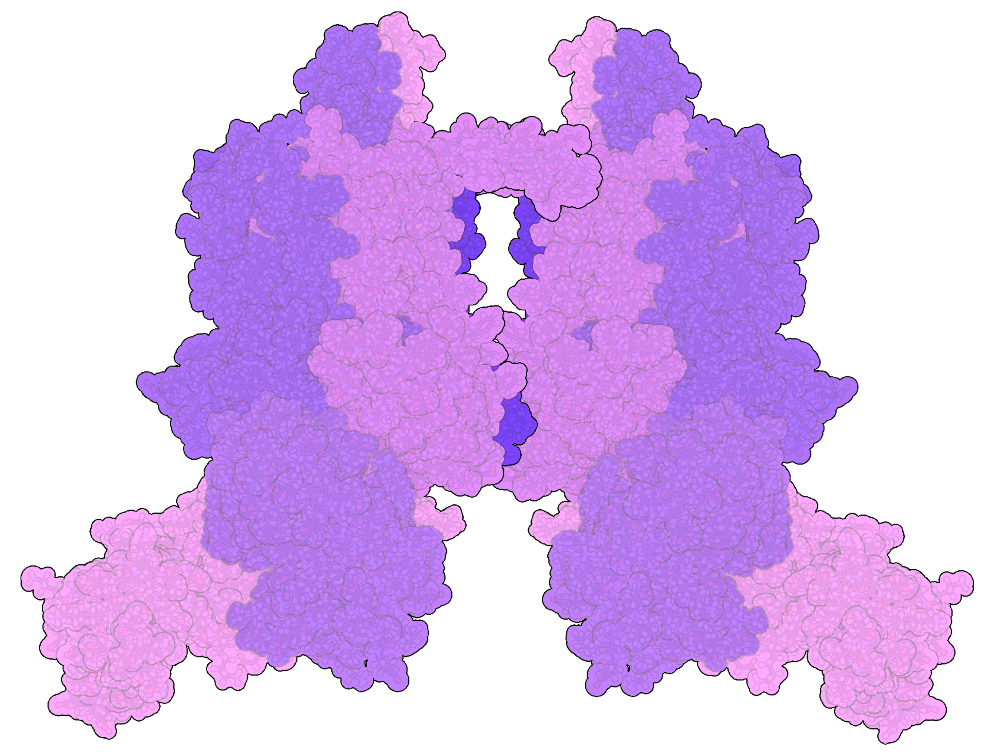</td>
    <td align="center"></td>
    <td align="center">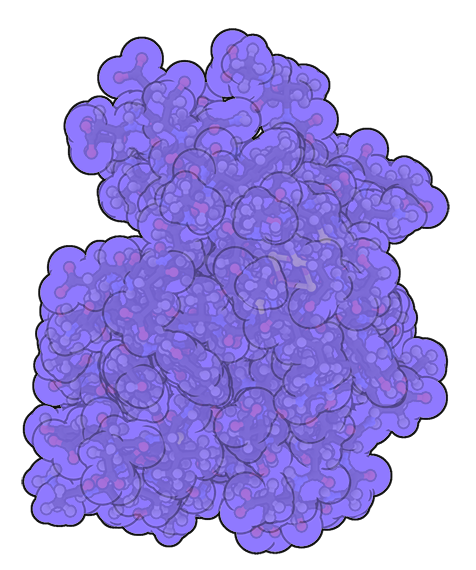</td>
  </tr>
  <tr>
    <td align="center" style="font-size:14px; line-height:1.45; padding:10px; vertical-align:top;">
      Cytochrome b₆f is a protein complex embedded in the thylakoid membrane that connects Photosystem II to Photosystem I. It accepts electrons from plastoquinol (PQH₂) and transfers them to plastocyanin via the Q-cycle mechanism. At the same time, it pumps additional protons from the stroma into the lumen, strengthening the proton gradient. This dual role makes cytochrome b₆f essential for both electron flow and ATP production.
      <br><a href="Documentation/Cytochrome_b6f.md" target="_blank" rel="noopener noreferrer" style="display:inline-block; margin-top:6px; font-size:13px;">Read more →</a>
    </td>
    <td align="center" style="font-size:14px; line-height:1.45; padding:10px; vertical-align:top;">
      Electrons are the charge carriers energized by light and moved through pigments, quinones, metals, and cofactors. They alternate between excited states and redox carriers during the light reactions. Ultimately, they reduce NADP⁺ to NADPH via PSI and FNR. The rate and path of electron flow determine ATP/NADPH output balance.
      <br><a href="Documentation/Electron.md" target="_blank" rel="noopener noreferrer" style="display:inline-block; margin-top:6px; font-size:13px;">Read more →</a>
    </td>
    <td align="center" style="font-size:14px; line-height:1.45; padding:10px; vertical-align:top;">
      Ferredoxin is a small stromal [2Fe–2S] protein that carries one electron at a time away from PSI. It shuttles electrons to ferredoxin–NADP reductase for NADPH formation. It also can feed cyclic electron flow around PSI, which boosts the proton gradient without producing NADPH. Its rapid diffusion and tuned redox potential make it an efficient terminal acceptor from PSI.
      <br><a href="Documentation/Ferredoxin.md" target="_blank" rel="noopener noreferrer" style="display:inline-block; margin-top:6px; font-size:13px;">Read more →</a>
    </td>
  </tr>
</table>

<br><br>

<!-- Ferredoxin–NADP reductase · G3P · Heme -->
<table align="center">
  <tr>
    <th align="center" width="250">Ferredoxin–NADP reductase</th>
    <th align="center" width="250">Glyceraldehyde-3-phosphate</th>
    <th align="center" width="250">Heme</th>
  </tr>
  <tr>
    <td align="center">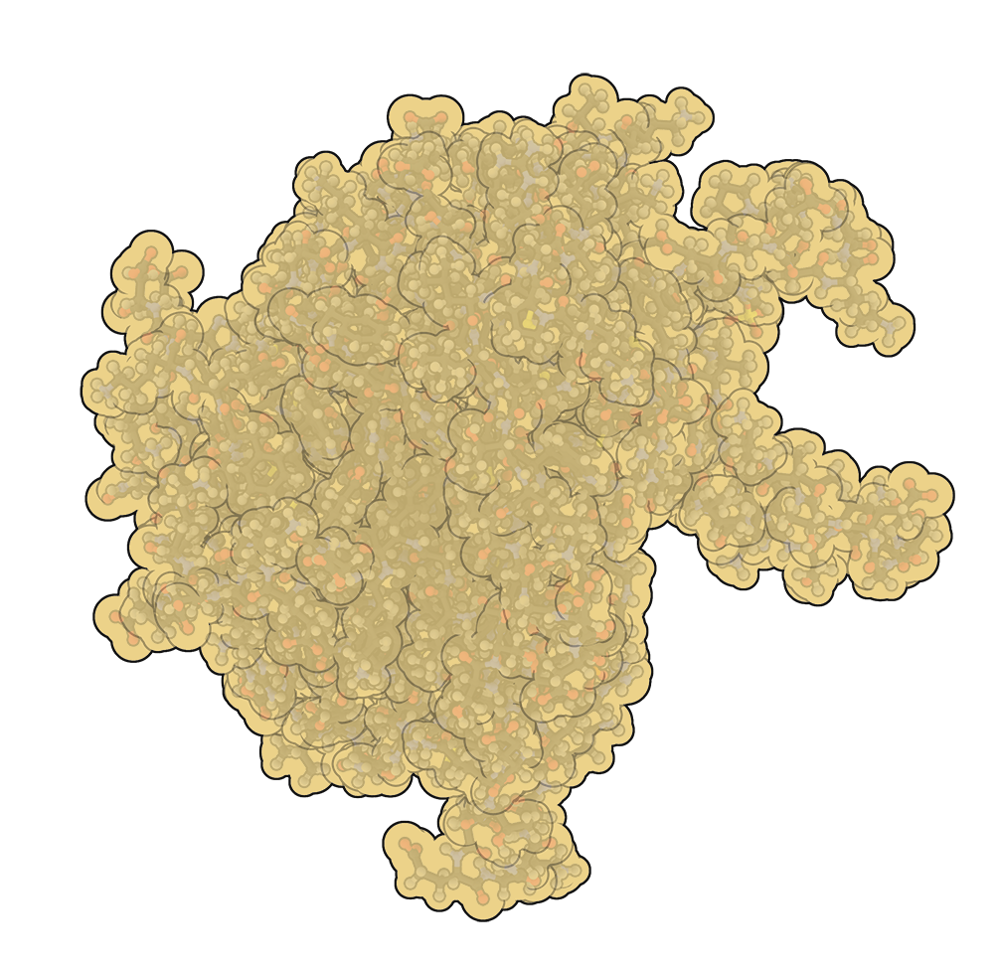</td>
    <td align="center"></td>
    <td align="center">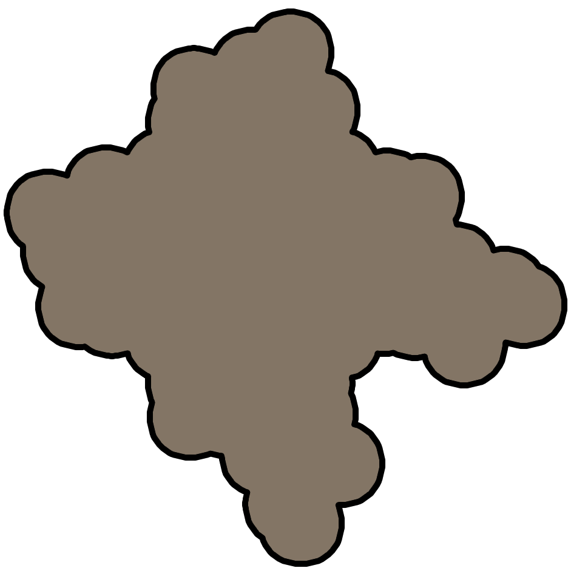</td>
  </tr>
  <tr>
    <td align="center" style="font-size:14px; line-height:1.45; padding:10px; vertical-align:top;">
      Ferredoxin–NADP reductase (FNR) is a flavoprotein containing FAD that catalyzes reduction of NADP⁺ to NADPH. It accepts electrons from reduced ferredoxin and transfers a hydride to NADP⁺ at the active site. FNR is found soluble in the stroma or bound near the thylakoid membrane, positioning it close to PSI. The NADPH produced supplies reducing power for the Calvin cycle and other biosynthetic reactions.
      <br><a href="Documentation/Ferredoxin-NADP_reductase.md" target="_blank" rel="noopener noreferrer" style="display:inline-block; margin-top:6px; font-size:13px;">Read more →</a>
    </td>
    <td align="center" style="font-size:14px; line-height:1.45; padding:10px; vertical-align:top;">
      Glyceraldehyde-3-phosphate (G3P) is a triose phosphate produced by reduction of 3-PGA. It can be exported to the cytosol for sucrose synthesis or retained for starch formation. Its export through the triose-phosphate/phosphate translocator is coupled to Pi import. The G3P/Pi balance helps coordinate chloroplast energy and carbon metabolism.
      <br><a href="Documentation/G3P.md" target="_blank" rel="noopener noreferrer" style="display:inline-block; margin-top:6px; font-size:13px;">Read more →</a>
    </td>
    <td align="center" style="font-size:14px; line-height:1.45; padding:10px; vertical-align:top;">
      Heme is the iron-porphyrin cofactor present in cytochromes b₆ and f of the b₆f complex. It carries electrons via reversible Fe²⁺/Fe³⁺ redox chemistry. Distinct heme types with different potentials coordinate the Q-cycle electron paths. Together they ensure efficient transfer from PQH₂ to plastocyanin.
      <br><a href="Documentation/Heme.md" target="_blank" rel="noopener noreferrer" style="display:inline-block; margin-top:6px; font-size:13px;">Read more →</a>
    </td>
  </tr>
</table>

<br><br>

<!-- NADP⁺ · O₂ · Oxygen evolving complex -->
<table align="center">
  <tr>
    <th align="center" width="250">NADP⁺</th>
    <th align="center" width="250">O₂</th>
    <th align="center" width="250">Oxygen evolving complex</th>
  </tr>
  <tr>
    <td align="center"></td>
    <td align="center">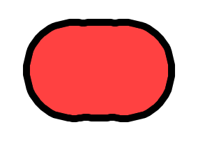</td>
    <td align="center"></td>
  </tr>
  <tr>
    <td align="center" style="font-size:14px; line-height:1.45; padding:10px; vertical-align:top;">
      NADP⁺ is the terminal electron acceptor of the photosynthetic electron-transport chain. FNR reduces NADP⁺ by transferring a hydride derived from ferredoxin. The resulting NADPH provides reducing equivalents for CO₂ fixation and stromal metabolism. Its pool size and redox state couple light reactions to the demands of the Calvin cycle.
      <br><a href="Documentation/NADP.md" target="_blank" rel="noopener noreferrer" style="display:inline-block; margin-top:6px; font-size:13px;">Read more →</a>
    </td>
    <td align="center" style="font-size:14px; line-height:1.45; padding:10px; vertical-align:top;">
      O₂ is released by water oxidation at Photosystem II into the lumen and then diffuses out of the chloroplast. While essential for aerobic life, O₂ can also participate in formation of reactive oxygen species under excess light. Plants deploy energy-dissipation and antioxidant systems to limit oxidative damage. Net O₂ evolution is a signature outcome of oxygenic photosynthesis.
      <br><a href="Documentation/O2.md" target="_blank" rel="noopener noreferrer" style="display:inline-block; margin-top:6px; font-size:13px;">Read more →</a>
    </td>
    <td align="center" style="font-size:14px; line-height:1.45; padding:10px; vertical-align:top;">
      The oxygen-evolving complex, also called the water-splitting complex, is bound to Photosystem II. It contains a cluster of four manganese ions, one calcium ion, and five oxygen atoms (Mn₄CaO₅ cluster). The OEC oxidizes two water molecules, releasing four protons into the lumen, four electrons to P680⁺, and one molecule of O₂ as a byproduct. This reaction is the only known biological source of atmospheric oxygen and is fundamental to life on Earth.
      <br><a href="Documentation/OEC.md" target="_blank" rel="noopener noreferrer" style="display:inline-block; margin-top:6px; font-size:13px;">Read more →</a>
    </td>
  </tr>
</table>

<br><br>

<!-- Pheophytin · Phosphate (Pi) · Phylloquinone (A₁) -->
<table align="center">
  <tr>
    <th align="center" width="250">Pheophytin</th>
    <th align="center" width="250">Phosphate (Pi)</th>
    <th align="center" width="250">Phylloquinone (A₁)</th>
  </tr>
  <tr>
    <td align="center"></td>
    <td align="center"></td>
    <td align="center"></td>
  </tr>
  <tr>
    <td align="center" style="font-size:14px; line-height:1.45; padding:10px; vertical-align:top;">
      Pheophytin is a Mg-free chlorophyll that accepts the first stabilized electron from excited P680* in PSII. It transfers the electron rapidly to QA, the primary quinone acceptor. This initiates reduction of the QB site and subsequent plastoquinol formation. By stabilizing charge separation, pheophytin prevents rapid recombination.
      <br><a href="Documentation/Pheophytin.md" target="_blank" rel="noopener noreferrer" style="display:inline-block; margin-top:6px; font-size:13px;">Read more →</a>
    </td>
    <td align="center" style="font-size:14px; line-height:1.45; padding:10px; vertical-align:top;">
      Inorganic phosphate (Pi) cycles during ATP/ADP interconversion and during triose-phosphate export. Pi availability in the stroma influences photophosphorylation rate and thylakoid proton motive force. The Pi–triose-phosphate translocator maintains phosphate balance across the envelope. Perturbations in Pi can feedback on ATP synthase activity and carbon assimilation.
      <br><a href="Documentation/Phosphate.md" target="_blank" rel="noopener noreferrer" style="display:inline-block; margin-top:6px; font-size:13px;">Read more →</a>
    </td>
    <td align="center" style="font-size:14px; line-height:1.45; padding:10px; vertical-align:top;">
      Phylloquinone (A₁) acts as an early electron acceptor within Photosystem I. It accepts an electron from A₀ (chlorophyll) and passes it to the FX [4Fe–4S] cluster. Its redox potential is finely tuned for rapid forward transfer while minimizing back reactions. This step helps secure directional electron flow toward ferredoxin.
      <br><a href="Documentation/Phylloquinone.md" target="_blank" rel="noopener noreferrer" style="display:inline-block; margin-top:6px; font-size:13px;">Read more →</a>
    </td>
  </tr>
</table>

<br><br>

<!-- Photon · Plastoquinone (PQ) · Plastoquinone B -->
<table align="center">
  <tr>
    <th align="center" width="250">Photon</th>
    <th align="center" width="250">Plastoquinone (PQ)</th>
    <th align="center" width="250">Plastoquinone B</th>
  </tr>
  <tr>
    <td align="center"></td>
    <td align="center">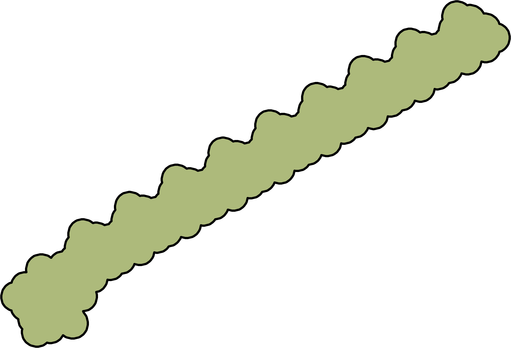</td>
    <td align="center"></td>
  </tr>
  <tr>
    <td align="center" style="font-size:14px; line-height:1.45; padding:10px; vertical-align:top;">
      Photons are quanta of light absorbed by pigments to create excited electronic states. Excitation energy migrates through antenna complexes to reaction centers. Primary charge separation converts photon energy into redox potential. Spectral quality and intensity shape photosynthetic yield and protection responses.
      <br><a href="Documentation/Photon.md" target="_blank" rel="noopener noreferrer" style="display:inline-block; margin-top:6px; font-size:13px;">Read more →</a>
    </td>
    <td align="center" style="font-size:14px; line-height:1.45; padding:10px; vertical-align:top;">
      Plastoquinone is a lipid-soluble quinone that shuttles electrons between PSII and cytochrome b₆f. It cycles between oxidized PQ and reduced PQH₂ while picking up and releasing protons. Oxidation at b₆f contributes two protons to the lumen per PQH₂ molecule. This diffusion-based shuttle links charge separation to proton translocation and ATP synthesis.
      <br><a href="Documentation/Plastoquinone.md" target="_blank" rel="noopener noreferrer" style="display:inline-block; margin-top:6px; font-size:13px;">Read more →</a>
    </td>
    <td align="center" style="font-size:14px; line-height:1.45; padding:10px; vertical-align:top;">
      Plastoquinone B is a mobile electron carrier located in Photosystem II’s QB binding site. It accepts two electrons sequentially from the QA plastoquinone and then takes up two protons from the stroma. Once reduced to plastoquinol (PQH₂), it diffuses into the thylakoid membrane to deliver electrons and protons to the cytochrome b₆f complex. PQB is therefore a key link between light-driven charge separation in PSII and the proton gradient used for ATP synthesis.
      <br><a href="Documentation/Plastoquinone_B.md" target="_blank" rel="noopener noreferrer" style="display:inline-block; margin-top:6px; font-size:13px;">Read more →</a>
    </td>
  </tr>
</table>

<br><br>

<!-- Plastocyanin · Proton · Proton_channel -->
<table align="center">
  <tr>
    <th align="center" width="250">Plastocyanin</th>
    <th align="center" width="250">Proton</th>
    <th align="center" width="250">Proton_channel</th>
  </tr>
  <tr>
    <td align="center">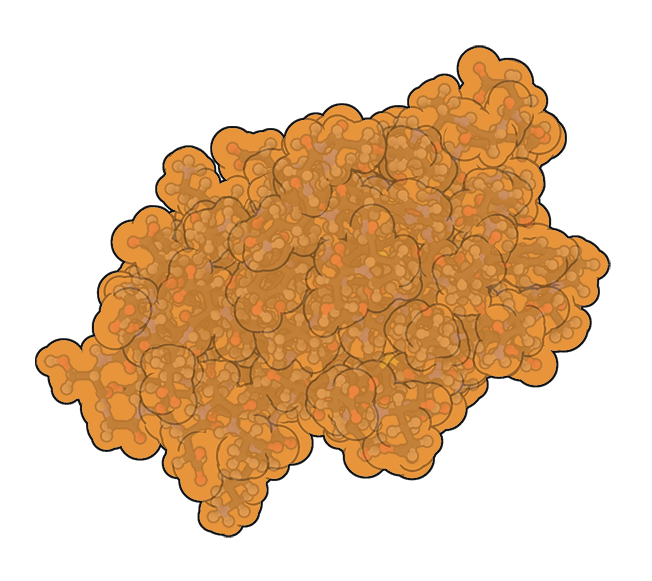</td>
    <td align="center"></td>
    <td align="center"></td>
  </tr>
  <tr>
    <td align="center" style="font-size:14px; line-height:1.45; padding:10px; vertical-align:top;">
      Plastocyanin is a small copper protein that shuttles single electrons between cytochrome b₆f and Photosystem I. It operates on the lumenal side of the thylakoid membrane and diffuses rapidly between complexes. By carrying one electron at a time, it maintains continuity of electron flow during the light reactions. Without plastocyanin, Photosystem I would lack the electrons needed to reduce ferredoxin and ultimately NADP⁺.
      <br><a href="Documentation/Plastocyanin.md" target="_blank" rel="noopener noreferrer" style="display:inline-block; margin-top:6px; font-size:13px;">Read more →</a>
    </td>
    <td align="center" style="font-size:14px; line-height:1.45; padding:10px; vertical-align:top;">
      Protons are central to photosynthesis because their movement across the thylakoid membrane creates a proton gradient. This gradient is generated by the splitting of water at the oxygen-evolving complex and by proton pumping through cytochrome b₆f. The energy stored in the gradient drives ATP synthase, which produces ATP, the cell’s primary energy currency. Without protons, the chemiosmotic mechanism of photosynthesis would not function, and ATP formation would halt.
      <br><a href="Documentation/Proton.md" target="_blank" rel="noopener noreferrer" style="display:inline-block; margin-top:6px; font-size:13px;">Read more →</a>
    </td>
    <td align="center" style="font-size:14px; line-height:1.45; padding:10px; vertical-align:top;">
      The proton channel (Fo) of ATP synthase conducts H⁺ through the c-ring embedded in the membrane. Proton flow drives rotation of the central stalk that powers ATP formation in the F₁ head. Channel conductance and coupling efficiency determine ATP yield per unit pmf. This mechanochemical transduction links the light reactions to cellular energy currency.
      <br><a href="Documentation/Proton_channel.md" target="_blank" rel="noopener noreferrer" style="display:inline-block; margin-top:6px; font-size:13px;">Read more →</a>
    </td>
  </tr>
</table>

<br><br>

<!-- Photosystem I · Photosystem II · Ribulose-1,5-bisphosphate (RuBP) -->
<table align="center">
  <tr>
    <th align="center" width="250">Photosystem I</th>
    <th align="center" width="250">Photosystem II</th>
    <th align="center" width="250">Ribulose-1,5-bisphosphate (RuBP)</th>
  </tr>
  <tr>
    <td align="center"></td>
    <td align="center"></td>
    <td align="center"></td>
  </tr>
  <tr>
    <td align="center" style="font-size:14px; line-height:1.45; padding:10px; vertical-align:top;">
      Photosystem I (PSI) uses the special pair P700 to drive electron transfer from plastocyanin to ferredoxin. It receives electrons delivered from PSII via cytochrome b₆f and plastocyanin. By photoexciting P700, PSI generates a highly reducing potential that enables reduction of ferredoxin. This step ultimately provides electrons for NADP⁺ reduction to NADPH by FNR.
      <br><a href="Documentation/Photosystem_I.md" target="_blank" rel="noopener noreferrer" style="display:inline-block; margin-top:6px; font-size:13px;">Read more →</a>
    </td>
    <td align="center" style="font-size:14px; line-height:1.45; padding:10px; vertical-align:top;">
      Photosystem II is the first major protein complex of the light reactions of photosynthesis. It captures photons with its chlorophyll molecules and uses the energy to extract electrons from water via the oxygen-evolving complex. The excited electrons are transferred to plastoquinone, initiating the electron transport chain. Photosystem II is the only protein complex able to split water, releasing oxygen as a byproduct.
      <br><a href="Documentation/Photosystem_II.md" target="_blank" rel="noopener noreferrer" style="display:inline-block; margin-top:6px; font-size:13px;">Read more →</a>
    </td>
    <td align="center" style="font-size:14px; line-height:1.45; padding:10px; vertical-align:top;">
      Ribulose-1,5-bisphosphate (RuBP) is the five-carbon CO₂ acceptor consumed by RuBisCO. It is regenerated in the Calvin cycle from triose phosphates using ATP and NADPH. Maintaining sufficient RuBP pools is essential to sustain carboxylation rates. Regeneration capacity sets an upper bound on steady-state CO₂ assimilation.
      <br><a href="Documentation/RuBP.md" target="_blank" rel="noopener noreferrer" style="display:inline-block; margin-top:6px; font-size:13px;">Read more →</a>
    </td>
  </tr>
</table>

<br><br>

<!-- RuBisCO · Tyrosine · Water -->
<table align="center">
  <tr>
    <th align="center" width="250">RuBisCO</th>
    <th align="center" width="250">Tyrosine</th>
    <th align="center" width="250">Water</th>
  </tr>
  <tr>
    <td align="center"></td>
    <td align="center"></td>
    <td align="center">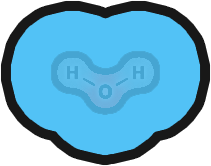</td>
  </tr>
  <tr>
    <td align="center" style="font-size:14px; line-height:1.45; padding:10px; vertical-align:top;">
      RuBisCO catalyzes the carboxylation of RuBP, initiating CO₂ fixation in the chloroplast stroma. It also catalyzes oxygenation of RuBP, leading to photorespiration. Rubisco activity is regulated by activase, pH, Mg²⁺, and substrate concentrations. As the gatekeeper for carbon entry, it often limits photosynthetic productivity.
      <br><a href="Documentation/RuBisCO.md" target="_blank" rel="noopener noreferrer" style="display:inline-block; margin-top:6px; font-size:13px;">Read more →</a>
    </td>
    <td align="center" style="font-size:14px; line-height:1.45; padding:10px; vertical-align:top;">
      In Photosystem II, the tyrosine residue Tyr<sub>Z</sub> (D1-Y161) relays electrons from the oxygen-evolving complex to P680⁺. This occurs via formation of a transient tyrosyl radical during proton-coupled electron transfer. The kinetics of Tyr<sub>Z</sub> oxidation and rereduction strongly influence water-oxidation turnover. This pathway stabilizes charge separation and enables sequential S-state transitions in the OEC.
      <br><a href="Documentation/Tyrosine.md" target="_blank" rel="noopener noreferrer" style="display:inline-block; margin-top:6px; font-size:13px;">Read more →</a>
    </td>
    <td align="center" style="font-size:14px; line-height:1.45; padding:10px; vertical-align:top;">
      Water is the initial electron donor in oxygenic photosynthesis. At the oxygen-evolving complex of Photosystem II, two H₂O molecules are oxidized to release O₂, four protons, and four electrons. The electrons refill the oxidized P680⁺, enabling continuous charge separation. The released protons contribute to the lumenal gradient that drives ATP synthesis.
      <br><a href="Documentation/Water.md" target="_blank" rel="noopener noreferrer" style="display:inline-block; margin-top:6px; font-size:13px;">Read more →</a>
    </td>
  </tr>
</table>


<br><br><br><br><br><br><br><br><br><br><br><br><br><br><br><br><br><br><br><br><br><br><br><br><br><br><br><br><br><br><br><br><br><br><br><br><br><br><br><br><br><br><br><br><br><br><br><br><br><br><br><br><br><br><br><br><br><br><br><br><br><br><br><br><br><br><br><br><br><br><br><br><br><br><br><br><br><br><br><br>
## Maybe some table of content?
- [Overview](#overview)
- [Installation](installation.md)
- [Usage](usage.md)
- [Biology](biology/proteins.md)
  - [Protein Complexes](biology/complexes.md)
  - [Photosystems](biology/photosystems/PSI.md)

test

## Proteins and protein complexes.
- <span style="color:#32CD32">🌿 Oxygen-evolving complex.</span>
  - Important short description of OEC.
  - [Read more details](Documentation/OEC.md).
  - Go to chapter directly: [function](Documentation/OEC.md#function).
  - Code sniplet [L301](scenes/Level_7_scenes_and_scripts/Photosystem_II.gd#L301).
  - Code sniplet [L301–L601](scenes/Level_7_scenes_and_scripts/Photosystem_II.gd#L301-L601).
- <span style="color:#32CD32">🌿 Photosystem II.</span>
  - Whatever.

## Some ideas to make MD look nice.
### Example GDScript.

```gdscript
func test():
    print("Protein Complexes!")
```

```py
func test():
    print("Protein Complexes!")
```


<details>
  <summary>
    ✅ GDScript dropdown test.🔎
  </summary>

  <pre><code style="color: orange;">
def water_binding():
    print("OEC binds two water molecules!")
  </code></pre>
</details>


<details>
  <summary>
    ✅ GDScript dropdown test.🔎
  </summary>
  <gdlink>"Project/Scripts/OEC.gd"</gdlink>
```py
def water_binding():
    print("OEC binds two water molecules!")
```
</details>


### Example MD image placement.
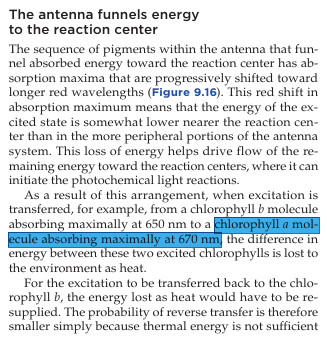


### 📊 Some diagrams.
- Diagrams with **Mermaid** (supported on GitHub!)  

Example:

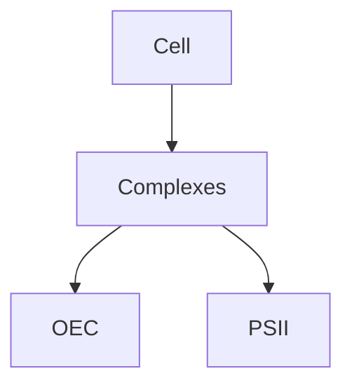

---
### Extra ideas:
- Glossary.md to keep links to each and every one element of cell biology.
---
